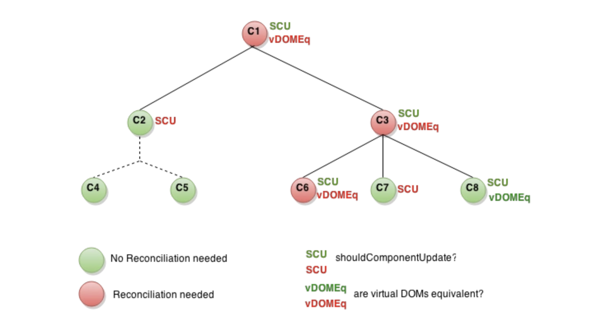

## React

- [React](#react)
  * [React 中 keys 的作用是什么？](#react---keys--------)
  * [调用 setState 之后发生了什么？](#---setstate---------)
  * [react 生命周期函数](#react-------)
  * [为什么虚拟 dom 会提高性能?](#------dom-------)
  * [react diff 原理](#react-diff---)
  * [React 中 refs 的作用是什么？](#react---refs--------)
  * [展示组件(Presentational component)和容器组件(Container component)之间有何不同](#-----presentational-component-------container-component-------)
  * [类组件(Class component)和函数式组件(Functional component)之间有何不同](#----class-component--------functional-component-------)
  * [(组件的)状态(state)和属性(props)之间有何不同](#--------state-----props-------)
  * [何为受控组件(controlled component)](#-------controlled-component-)
  * [何为高阶组件(higher order component)](#-------higher-order-component-)
  * [为什么建议传递给 setState 的参数是一个 callback 而不是一个对象](#---------setstate--------callback--------)
  * [除了在构造函数中绑定 this，还有其它方式吗](#-----------this--------)
  * [(在构造函数中)调用 super(props) 的目的是什么](#-----------super-props--------)
  * [应该在 React 组件的何处发起 Ajax 请求](#----react---------ajax---)
  * [描述事件在 React 中的处理方式。](#------react--------)
  * [createElement 和 cloneElement 有什么区别？](#createelement---cloneelement-------)
  * [React.cloneElement()与 React.createElement()相似，不同的是它传入的第一个参数是一个 React 元素，而不是标签名或组件。新添加的属性会并入原有的属性，传入到返回的新元素中，而就的子元素奖杯替换。](#reactcloneelement----reactcreateelement----------------------react---------------------------------------------------)
  * [React 中有三种构建组件的方式](#react------------)
  * [react 组件的划分业务组件技术组件？](#react---------------)
  * [简述 flux 思想](#---flux---)
  * [React 项目用过什么脚手架（本题是开放性题目）](#react--------------------)
  * [了解 redux 么，说一下 redux 吧](#---redux-------redux--)
  * [redux 有什么缺点](#redux------)
  * [在生命周期中的哪一步你应该发起 Ajax 请求](#----------------ajax---)
  * [React v16 新特性](#react-v16----)
      - [fragments 返回片段类型](#fragments-------)
      - [error boundaries (处理错误 )](#error-boundaries--------)
      - [portals 挂载方式](#portals-----)
      - [Customer DOM Attribute (支持自定义 DOM 属性)](#customer-dom-attribute--------dom----)
      - [Improved Server-side Rendering (提升服务端渲染性能)](#improved-server-side-rendering------------)
      - [Reduced File Size (减少文件大小)](#reduced-file-size---------)
      - [新的生命周期方法](#--------)
      - [新的 Context API](#---context-api)
  * [React 受控组件与非受控组件](#react-----------)
      - [受控组件](#----)
      - [非受控组件](#-----)

### 对 React 的理解

React 构建用户界面的JavaScript库

- 专注于 View 层
- 以虚拟DOM 的方式提高渲染性能
- 内部的 state immutable
- 更方便灵活的方式实现组件化

##### props state 和 render 函数的关系，数据和页面互相联动的底层机制

当组件的 state 或者 props 发生改变，自己的render 函数就会重新执行

##### React 中的虚拟 DOM


### React 中 keys 的作用是什么？

Keys 是 React 用于追踪哪些列表中元素被修改、被添加或者被移除的辅助标识。

```js
render () {
  return (
    <ul>
      {this.state.todoItems.map(({item, key}) => {
        return <li key={key}>{item}</li>
      })}
    </ul>
  )
}
```

在开发过程中，我们需要保证某个元素的 key 在其同级元素中具有唯一性。在 React Diff 算法中 React 会借助元素的 Key 值来判断该元素是新近创建的还是被移动而来的元素，从而减少不必要的元素重渲染。此外，React 还需要借助 Key 值来判断元素与本地状态的关联关系，因此我们绝不可忽视转换函数中 Key 的重要性。

### 调用 setState 之后发生了什么？

在代码中调用 setState 函数之后，React 会将传入的参数对象与组件当前的状态合并，然后触发所谓的调和过程（Reconciliation）。经过调和过程，React 会以相对高效的方式根据新的状态构建 React 元素树并且着手重新渲染整个 UI 界面。在 React 得到元素树之后，React 会自动计算出新的树与老树的节点差异，然后根据差异对界面进行最小化重渲染。在差异计算算法中，React 能够相对精确地知道哪些位置发生了改变以及应该如何改变，这就保证了按需更新，而不是全部重新渲染。

### react 生命周期函数

初始化阶段：
- getDefaultProps:获取实例的默认属性
- getInitialState:获取每个实例的初始化状态
- componentWillMount：组件即将被装载、渲染到页面上
- render:组件在这里生成虚拟的 DOM 节点
- componentDidMount:组件真正在被装载之后
运行中状态：
- componentWillReceiveProps:组件将要接收到属性的时候调用
- shouldComponentUpdate:组件接受到新属性或者新状态的时候（可以返回 false，接收数据后不更新，阻止 render 调用，后面的函数不会被继续执行了）
- componentWillUpdate:组件即将更新不能修改属性和状态
- render:组件重新描绘
- componentDidUpdate:组件已经更新
销毁阶段：
- componentWillUnmount:组件即将销毁
- shouldComponentUpdate 是做什么的，（react 性能优化是哪个周期函数？）
- shouldComponentUpdate 这个方法用来判断是否需要调用 render 方法重新描绘 dom。因为 dom 的描绘非常消耗性能，如果我们能在 shouldComponentUpdate 方法中能够写出更优化的 dom diff 算法，可以极大的提高性能。

参考react 性能优化-sf


### 为什么虚拟 dom 会提高性能?

虚拟 dom 相当于在 js 和真实 dom 中间加了一个缓存，利用 dom diff 算法避免了没有必要的 dom 操作，从而提高性能。

用 JavaScript 对象结构表示 DOM 树的结构；然后用这个树构建一个真正的 DOM 树，插到文档当中当状态变更的时候，重新构造一棵新的对象树。然后用新的树和旧的树进行比较，记录两棵树差异把 2 所记录的差异应用到步骤 1 所构建的真正的 DOM 树上，视图就更新了。

参考 如何理解虚拟 DOM?-zhihu


### react diff 原理

- 把树形结构按照层级分解，只比较同级元素。
- 给列表结构的每个单元添加唯一的 key 属性，方便比较。
- React 只会匹配相同 class 的 component（这里面的 class 指的是组件的名字）
- 合并操作，调用 component 的 setState 方法的时候, React 将其标记为 dirty.到每一个事件循环结束, React 检查所有标记 dirty 的 component 重新绘制.
- 选择性子树渲染。开发人员可以重写 shouldComponentUpdate 提高 diff 的性能。
参考：React 的 diff 算法

### React 中 refs 的作用是什么？

Refs 是 React 提供给我们的安全访问 DOM 元素或者某个组件实例的句柄。我们可以为元素添加 ref 属性然后在回调函数中接受该元素在 DOM 树中的句柄，该值会作为回调函数的第一个参数返回：

```js
class CustomForm extends Component {
  handleSubmit = () => {
    console.log("Input Value: ", this.input.value)
  }
  
  render () {
    return (
      <form onSubmit={this.handleSubmit}>
        <input
          type='text'
          ref={(input) => this.input = input} />
        <button type='submit'>Submit</button>
      </form>
    )
  }
}
```

上述代码中的 input 域包含了一个 ref 属性，该属性声明的回调函数会接收 input 对应的 DOM 元素，我们将其绑定到 this 指针以便在其他的类函数中使用。另外值得一提的是，refs 并不是类组件的专属，函数式组件同样能够利用闭包暂存其值：

```js
function CustomForm ({handleSubmit}) {
  let inputElement

  return (
    <form onSubmit={() => handleSubmit(inputElement.value)}>
      <input
        type='text'
        ref={(input) => inputElement = input} />
      <button type='submit'>Submit</button>
    </form>
  )
}
```

如果你创建了类似于下面的 Twitter 元素，那么它相关的类定义是啥样子的？

```js
<Twitter username='tylermcginnis33'>
  {(user) => user === null
    ? <Loading />
    : <Badge info={user} />}
</Twitter>
```
​
```js
import React, { Component, PropTypes } from 'react'
import fetchUser from 'twitter'
// fetchUser take in a username returns a promise
// which will resolve with that username's data.

class Twitter extends Component {
  // finish this
}
```

如果你还不熟悉回调渲染模式（Render Callback Pattern），这个代码可能看起来有点怪。这种模式中，组件会接收某个函数作为其子组件，然后在渲染函数中以 props.children 进行调用：

```js
import React, { Component, PropTypes } from 'react'
import fetchUser from 'twitter'

class Twitter extends Component {
  state = {
    user: null,
  }

  static propTypes = {
    username: PropTypes.string.isRequired,
  }

  componentDidMount () {
    fetchUser(this.props.username)
      .then((user) => this.setState({user}))
  }
  render () {
    return this.props.children(this.state.user)
  }
}
```

这种模式的优势在于将父组件与子组件解耦和，父组件可以直接访问子组件的内部状态而不需要再通过 Props 传递，这样父组件能够更为方便地控制子组件展示的 UI 界面。譬如产品经理让我们将原本展示的 Badge 替换为 Profile，我们可以轻易地修改下回调函数即可：
​
```html
<Twitter username='tylermcginnis33'>
  {(user) => user === null
    ? <Loading />
    : <Profile info={user} />}
</Twitter>
```
​
### 展示组件(Presentational component)和容器组件(Container component)之间有何不同

展示组件关心组件看起来是什么。展示专门通过 props 接受数据和回调，并且几乎不会有自身的状态，但当展示组件拥有自身的状态时，通常也只关心 UI 状态而不是数据的状态。
容器组件则更关心组件是如何运作的。容器组件会为展示组件或者其它容器组件提供数据和行为(behavior)，它们会调用 Flux actions，并将其作为回调提供给展示组件。容器组件经常是有状态的，因为它们是(其它组件的)数据源。

### 类组件(Class component)和函数式组件(Functional component)之间有何不同

类组件不仅允许你使用更多额外的功能，如组件自身的状态和生命周期钩子，也能使组件直接访问 store 并维持状态
当组件仅是接收 props，并将组件自身渲染到页面时，该组件就是一个 '无状态组件(stateless component)'，可以使用一个纯函数来创建这样的组件。这种组件也被称为哑组件(dumb components)或展示组件

### (组件的)状态(state)和属性(props)之间有何不同

- State 是一种数据结构，用于组件挂载时所需数据的默认值。State 可能会随着时间的推移而发生突变，但多数时候是作为用户事件行为的结果。
- Props(properties 的简写)则是组件的配置。props 由父组件传递给子组件，并且就子组件而言，props 是不可变的(immutable)。组件不能改变自身的 props，但是可以把其子组件的 props 放在一起(统一管理)。Props 也不仅仅是数据--回调函数也可以通过 props 传递。

### 何为受控组件(controlled component)

在 HTML 中，类似 <input>, <textarea> 和 <select> 这样的表单元素会维护自身的状态，并基于用户的输入来更新。当用户提交表单时，前面提到的元素的值将随表单一起被发送。但在 React 中会有些不同，包含表单元素的组件将会在 state 中追踪输入的值，并且每次调用回调函数时，如 onChange 会更新 state，重新渲染组件。一个输入表单元素，它的值通过 React 的这种方式来控制，这样的元素就被称为"受控元素"。

### 何为高阶组件(higher order component)

高阶组件是一个以组件为参数并返回一个新组件的函数。HOC 运行你重用代码、逻辑和引导抽象。最常见的可能是 Redux 的 connect 函数。除了简单分享工具库和简单的组合，HOC 最好的方式是共享 React 组件之间的行为。如果你发现你在不同的地方写了大量代码来做同一件事时，就应该考虑将代码重构为可重用的 HOC。

### 为什么建议传递给 setState 的参数是一个 callback 而不是一个对象

因为 this.props 和 this.state 的更新可能是异步的，不能依赖它们的值去计算下一个 state。

### 除了在构造函数中绑定 this，还有其它方式吗

你可以使用属性初始值设定项(property initializers)来正确绑定回调，create-react-app 也是默认支持的。在回调中你可以使用箭头函数，但问题是每次组件渲染时都会创建一个新的回调。

### (在构造函数中)调用 super(props) 的目的是什么

在 super() 被调用之前，子类是不能使用 this 的，在 ES2015 中，子类必须在 constructor 中调用 super()。传递 props 给 super() 的原因则是便于(在子类中)能在 constructor 访问 this.props。

### 应该在 React 组件的何处发起 Ajax 请求

在 React 组件中，应该在 componentDidMount 中发起网络请求。这个方法会在组件第一次“挂载”(被添加到 DOM)时执行，在组件的生命周期中仅会执行一次。更重要的是，你不能保证在组件挂载之前 Ajax 请求已经完成，如果是这样，也就意味着你将尝试在一个未挂载的组件上调用 setState，这将不起作用。在 componentDidMount 中发起网络请求将保证这有一个组件可以更新了。

### 描述事件在 React 中的处理方式。

为了解决跨浏览器兼容性问题，您的 React 中的事件处理程序将传递 SyntheticEvent 的实例，它是 React 的浏览器本机事件的跨浏览器包装器。

这些 SyntheticEvent 与您习惯的原生事件具有相同的接口，除了它们在所有浏览器中都兼容。有趣的是，React 实际上并没有将事件附加到子节点本身。React 将使用单个事件监听器监听顶层的所有事件。这对于性能是有好处的，这也意味着在更新 DOM 时，React 不需要担心跟踪事件监听器。

### createElement 和 cloneElement 有什么区别？

React.createElement():JSX 语法就是用 React.createElement()来构建 React 元素的。它接受三个参数，第一个参数可以是一个标签名。如 div、span，或者 React 组件。第二个参数为传入的属性。第三个以及之后的参数，皆作为组件的子组件。

```js
React.createElement(
    type,
    [props],
    [...children]
)
```
​
### React.cloneElement()与 React.createElement()相似，不同的是它传入的第一个参数是一个 React 元素，而不是标签名或组件。新添加的属性会并入原有的属性，传入到返回的新元素中，而就的子元素奖杯替换。

```js
React.cloneElement(
  element,
  [props],
  [...children]
)
```
​
### React 中有三种构建组件的方式

React.createClass()、ES6 class 和无状态函数。

### react 组件的划分业务组件技术组件？

根据组件的职责通常把组件分为 UI 组件和容器组件。
UI 组件负责 UI 的呈现，容器组件负责管理数据和逻辑。
两者通过 React-Redux 提供 connect 方法联系起来。

### 简述 flux 思想

Flux 的最大特点，就是数据的"单向流动"。

用户访问 View
View 发出用户的 Action
Dispatcher 收到 Action，要求 Store 进行相应的更新
Store 更新后，发出一个"change"事件
View 收到"change"事件后，更新页面

### React 项目用过什么脚手架（本题是开放性题目）

creat-react-app Yeoman 等

### 了解 redux 么，说一下 redux 吧

redux 是一个应用数据流框架，主要是解决了组件间状态共享的问题，原理是集中式管理，主要有三个核心方法，action，store，reducer，工作流程是 view 调用 store 的 dispatch 接收 action 传入 store，reducer 进行 state 操作，view 通过 store 提供的 getState 获取最新的数据，flux 也是用来进行数据操作的，有四个组成部分 action，dispatch，view，store，工作流程是 view 发出一个 action，派发器接收 action，让 store 进行数据更新，更新完成以后 store 发出 change，view 接受 change 更新视图。Redux 和 Flux 很像。主要区别在于 Flux 有多个可以改变应用状态的 store，在 Flux 中 dispatcher 被用来传递数据到注册的回调事件，但是在 redux 中只能定义一个可更新状态的 store，redux 把 store 和 Dispatcher 合并,结构更加简单清晰
新增 state,对状态的管理更加明确，通过 redux，流程更加规范了，减少手动编码量，提高了编码效率，同时缺点时当数据更新时有时候组件不需要，但是也要重新绘制，有些影响效率。一般情况下，我们在构建多交互，多数据流的复杂项目应用时才会使用它们

### redux 有什么缺点

一个组件所需要的数据，必须由父组件传过来，而不能像 flux 中直接从 store 取。
当一个组件相关数据更新时，即使父组件不需要用到这个组件，父组件还是会重新 render，可能会有效率影响，或者需要写复杂的 shouldComponentUpdate 进行判断。

### 在生命周期中的哪一步你应该发起 Ajax 请求

componentDidMount　

- React 调和算法 Fiber 会通过开始或停止渲染的方式优化应用性能，其会影响到 componentWillMount 的触发次数。对于 componentWillMount 这个生命周期函数的调用次数会变得不确定，React 可能会多次频繁调用 componentWillMount。如果我们将 Ajax 请求放到 componentWillMount 函数中，那么显而易见其会被触发多次，自然也就不是好的选择。
- 如果我们将 Ajax 请求放置在其他生命周期函数中，并不能保证请求仅在组件挂载完毕后才会要求响应。如果我们的数据请求在组件挂载完成之前就完成了，并调用的 setState 函数，对于未挂载的组件则会报错，componentDidMount 函数中进行Ajax 可以避免这个问题。

### React v16 新特性

##### fragments 返回片段类型

```jsx
// 不需要再把所有的元素绑定到一个单独的元素中了
render() {
  return [
    // 别忘记加上key值
    <li key='A'>first item</li>,
    <li key='B'>second item</li>,
    <li key='A'>third item</li>
  ];
}
```

##### error boundaries (处理错误 )

更弹性的错误处理策略。默认情况下，如果一个错误是在组件的渲染 或者生命周期方法中被抛出，整个组件结构就会从跟节点中卸载。这种方式阻碍了被坏数据的展示，然而却不是很好的用户体验。

对于这种问题可以使用 error boundaries 来处理，专门用来抓取其下子组件错误并展示错误信息

一个类组件定义新的生命周期 `componentDidCatch(error,  info)`  之后，他就变成了一个 `error boundary`

```js
class ErrorBoundary extends React.Component {
  constructor(props) {
    super(props);
    this.state = { hasError: false };
  }

  componentDidCatch(error, info) {
    // Display fallback UI
    this.setState({ hasError: true });
    // You can also log the error to an error reporting service
    logErrorToMyService(error, info);
  }

  render() {
    if (this.state.hasError) {
      // You can render any custom fallback UI
      return <h1>Something went wrong.</h1>;
    }
    return this.props.children;
  }
}
```

可以像正常的组件一样使用：

```html
<ErrorBoundary>
  <MyWidget />
</ErrorBoundary>
```

**error boundaries only catch errors in the components below them in the tree.**

##### portals 挂载方式

```js
render() {
  // React does *not* create a new div. It renders the children into `domNode`.
  // `domNode` is any valid DOM node, regardless of its location in the DOM.
  return ReactDOM.createPortal(
    this.props.children,
    domNode,
  );
}
```

##### Customer DOM Attribute (支持自定义 DOM 属性)
##### Improved Server-side Rendering (提升服务端渲染性能)
##### Reduced File Size (减少文件大小)
##### 新的生命周期方法

- componentWillMount --> componentDidMount
- componentWillUpdate --> componentDidUpdate
- componentWillReceiveProps --> 新方法 `static getDerivedStateFromProps`

```js
static getDerivedStateFromProps(nextProps, prevState) {
  if(nextProps.currentRow === prevState.lastRow) {
    return null;
  }
 
  return {
    lastRow: nextProps.currentRow,
    isCrollingDown: nextProps.curentRow > prevState.lastRow
  }
}
```

##### 新的 Context API

- `React.createContext` 方法用于创建一个 `Context` 对象。该对象包含 `Provider` 和 `Consumer` 两个属性，分别为两个 `React` 组件。
- `Provider` 组件。用在组件树中更外层的位置。它接受一个名为 `value` 的 `prop`，其值可以是任何 `JavaScript` 中的数据类型。
- `Consumer` 组件。可以在 `Provider` 组件内部的任何一层使用。它接收一个名为 `children` 值为一个函数的 `prop`。这个函数的参数是 `Provider` 组件接收的那个 `value prop` 的值，返回值是一个 `React` 元素（一段 `JSX` 代码)

### React 受控组件与非受控组件

React 推荐使用受控组件处理表单数据。在一个受控组件中，表单数据是由 React 组件来管理的。另一种替代方案是使用非受控组件，这时表单数据将交由 DOM 节点处理。

##### 受控组件

在 HTML 中，表单元素(如 `input` `textarea` `select` ) 之类的表单元素通常自己维护 `state`，并根据用户输入进行更新。而在 `React` 中，可变状态 （`mutable state`），通常保存在组件的 `state` 属性中，并且只能通过 `setState` 来更新

我们可以吧两者结合起来，使 `React` 的 `state` 成为 "唯一数据源"。渲染表单的 `React` 组件还控制着用户输入过程中表单发生的操作。被 React 以这种方式控制取值的变淡数据元素叫做 `受控组件`

##### 非受控组件

编写一个非受控组件，而不是为每个状态更新都编写数据处理函数，你可以使用 ref 来从 DOM 节点中获取表单数据。

```jsx harmony
class NameForm extends React.Component {
  constructor(props) {
    super(props);
    this.handleSubmit = this.handleSubmit.bind(this);
    this.input = React.createRef();
  }

  handleSubmit(event) {
    alert('A name was submitted: ' + this.input.current.value);
    event.preventDefault();
  }

  render() {
    return (
      <form onSubmit={this.handleSubmit}>
        <label>
          Name:
          <input type="text" ref={this.input} />
        </label>
        <input type="submit" value="Submit" />
      </form>
    );
  }
}
```

### React Hook

Hook 是一些可以让你在函数组件里"钩入"React state 及生命周期等特性的函数。Hook 不能在class组件中使用，这使得你不使用 class 也能使用 React

```jsx harmony
import React, { useState } from 'react';

function Example() {
  // 声明一个新的叫做 “count” 的 state 变量
  const [count, setCount] = useState(0);

  return (
    <div>
      <p>You clicked {count} times</p>
      <button onClick={() => setCount(count + 1)}>
        Click me
      </button>
    </div>
  );
}
```

useState: 一个Hook，通过在函数组件里调用来给组件添加一些内部 的 state，react 在重复渲染的时候会保留这个 state。
count: state 的当前值

##### useEffect

当你调用 useEffect 时，就是在告诉 React 在完成对 DOM 的更改后运行你的“副作用”函数。由于副作用函数是在组件内声明的，所以它们可以访问到组件的 props 和 state。默认情况下，React 会在每次渲染后调用副作用函数 —— 包括第一次渲染的时候。（我们会在使用 Effect Hook 中跟 class 组件的生命周期方法做更详细的对比。）

副作用函数还可以通过返回一个函数来指定如何“清除”副作用。例如，在下面的组件中使用副作用函数来订阅好友的在线状态，并通过取消订阅来进行清除操作：

##### Hook 规则

- 只能在函数最外层调用 Hook。不要在循环、条件判断或者子函数中调用。
- 只能在 React 的函数组件中调用 Hook。不要在其他 JavaScript 函数中调用。（还有一个地方可以调用 Hook —— 就是自定义的 Hook 中，我们稍后会学习到。）

### React 性能优化

##### 使用 Production 版本
##### 避免更新 DOM

使用 shouldComponentUpdate 避免进行昂贵的更新DOM子树的操作。

##### shouldComponentUpdate



这里有一个组件的子树，每一个 都指明了shouldComponentUpdate 返回值和 虚拟DOM 是否相等，最后圆圈红色的需要重新渲染

决定组件是否更新有两个标准，一个 shouldComponentUpdate 和 VDOM 是否相等。如果 shouldComponentUpdate 返回为 true 并且 react经过重新虚拟DOM计算，跟之前的虚拟dom树一致，则没必要更新真实的DOM。

##### ImmutableJS

ImmutableJS 每次改变都会返回一个新对象，仅仅需要对象引用是否改变

```js
var SomeRecord = Immutable.Record({ foo: null });
var x = new SomeRecord({ foo: 'bar'  });
var y = x.set('foo', 'baz');
x === y; // false
```

### React 创建组件的几种方法和他们的区别

##### CreateClass
```js
var Greeting = React.createClass({
  propTypes, getDefaultProps, getInitialState, render
})
```

在createClass中，React对属性中的所有函数都进行了this绑定

##### Component

```js 
class Greeting extends React.Component {}
```


##### PureComponent

但是 `PureComponent` 通过 `prop` `nextProp` 和 `state` `nextState` 的浅比较来实现 `shouldComponentUpdate`，某些情况下可以用 `PureComponent` 提升性能

##### Stateless Functional component

###### 16.8 版本之前

- Component 包含内部state，而Stateless Functional Component所有数据都来自props，没有内部state;
- Component 包含的一些生命周期函数，Stateless Functional Component都没有，因为Stateless Functional component没有shouldComponentUpdate,所以也无法控制组件的渲染，也即是说只要是收到新的props，Stateless Functional Component就会重新渲染
- Stateless Functional Component 不支持Refs

###### 16.8 版本添加 Hook 之后

在 react官方文档中有一段关于添加Hooks后的介绍 

    "You might have previously known these as “stateless components”. We’re now introducing the ability to use React state from these, so we prefer the name “function components”.Hooks don’t work inside classes. But you can use them instead of writing classes."
    
- 通过 `useState` Function Component 可以拥有 state
- 通过 `useEffect`  Function Component 可以有一些初始的生命周
