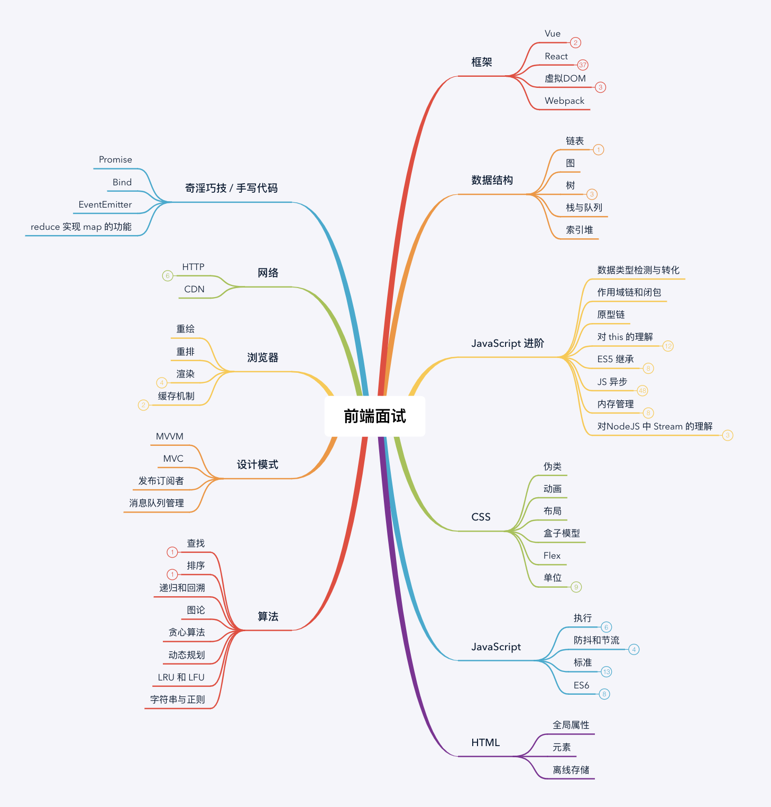

# 前端面试题

[题目列表](./FE/List.md)

公众号 | Github 博客
---|---
 | [@跳动的神经元](https://github.com/georgezouq/blog)

### 知识点

- [前端面试准备](./FE/Prepare.md)
- [Javascript](./FE/JS.md)
- [HTML](./FE/HTML.md)
- [CSS](./FE/CSS.md)
- [算法](./FE/Algorithm.md)
- [网络与浏览器](./FE/NetworkBrowser.md)
- [Vue](./FE/Vue.md)
- [React](./FE/React.md)
- [深度](./FE/Senior.md)

### 公司

- [字节跳动](./FE/company/字节跳动.md)
- [美团点评](./FE/company/美团点评.md)
- [百度](./FE/company/百度.md)
- [钉钉](./FE/company/钉钉.md)
- [小米](./FE/company/小米.md)
- [新浪](./FE/company/新浪.md)
- [知乎](./FE/company/知乎.md)
- [腾讯](./FE/company/腾讯.md)
- [雪球](./FE/company/雪球.md)
- [跟谁学](./FE/company/跟谁学.md)

### 其他资源

- [面试官系列](https://juejin.im/post/5bf8dab3f265da61590b55d4)
- [面试必备的13道可以举一反三的Vue面试题](https://juejin.im/post/5d41eec26fb9a06ae439d29f)
- [挑战一轮大厂后的面试总结 (含六个方向) - javascript 篇(万字长文)](https://juejin.im/post/5e523e726fb9a07c9a195a95)
- [2020 前端面试 | 第一波面试题总结](https://juejin.im/post/5e3d898cf265da5732551a56)
- [经典大厂前端面试题（含解析）基础篇(一)](https://juejin.im/post/5df98b825188251277365bc1)
- [前端面试每日 3+1，以面试题来驱动学习](https://github.com/haizlin/fe-interview)
- [(1.8w字)负重前行，前端工程师如何系统练习数据结构和算法？【上】](https://juejin.im/post/5e2f88156fb9a02fdd38a184): 区间反转
- [微任务、宏任务与Event-Loop](https://juejin.im/post/5b73d7a6518825610072b42b)
- [浏览器说：虽然都叫event loop，但是我和node不一样](https://juejin.im/post/5b0ab722f265da0dbd7a646f)

- [万字长文干货，面试官角度看面试](https://juejin.im/post/5ef2a80ae51d4573e919cbe8)
- [由浅入深，66条JavaScript面试知识点](https://juejin.im/post/5ef8377f6fb9a07e693a6061#heading-21)
