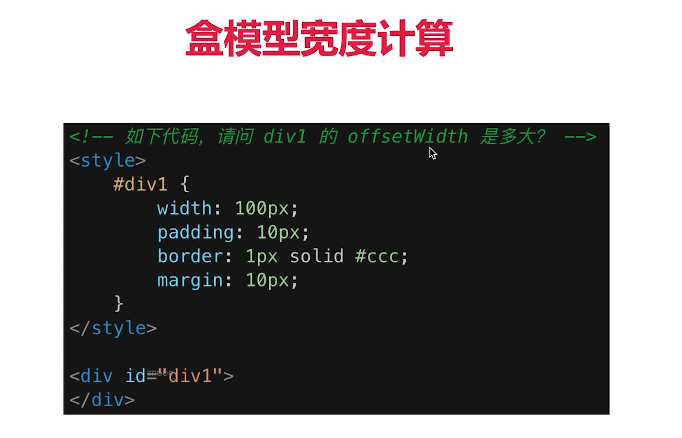

# CSS - 布局

### 盒模型的宽度如何计算

内容宽度 - padding - border - margin

如下代码中的 offsetWidth 是多大？



- offsetWidth = 内容宽度 + 内边距 + 边框

offsetWidth 无外边距

so，答案是 122

#### 如果让 offsetWidth = 100px，怎么做

`box-sizing: border-box`

加了这个之后，内容宽度回正题缩小，100px 即 内容宽度 + padding + border

### margin 纵向重叠问题

- 相邻元素的 margin-top 和 margin-bottom 回发生重叠
- 空内容也会重叠

#### 代码中，AAA 和 BBB之间的距离是多少

```html
<style>
  p {
    font-size: 16px;
    line-height: 1;
    margin-top: 10px;
    margin-bottom: 15px;
  }
</style>

<p>AAA</p>
<p></p>
<p></p>
<p></p>
<p>BBB</p>
```

答案：15px

### margin 负值的问题

#### 对 margin 的 top left right bottom 设置负值，有什么效果？

- margin-top 和 margin-left 负值，元素向上、想左移动
- margin-right 负值，右侧元素左移，自身不受影响
- margin-bottom 负值，下方元素上移动，自身不受影响

### BFC 的理解和应用

- Block format context 块级格式化上下文
- 一块独立的渲染区域，内部元素的渲染不会影响到边界以外的元素

形成 BFC的条件有哪些？

- float 不是 none
- position 是 absolute 或 fixed
- overflow 不是 visible
- display 是 flex inline-block

常见的应用

- 清除浮动

### Float 布局的问题，以及 Clearfix

#### 如何实现圣杯布局和双飞翼布局

- 三栏布局，中间一栏最先加载和渲染
- 两侧内容固定，中间内容随着宽度自适应
- 一般用于PC网页

圣杯和双飞翼布局技术总结

- 使用 float 布局
- 两侧试用 margin 负值，以便和中间内容横向重叠
- 防止中间内容被两侧覆盖，一个用 padding，一个用 margin

圣杯布局通过 padding 左右留白，双飞翼布局通过 margin 左右留白

#### 手写 clearfix

```css
.clearfix:after {
  content: '';
  display: table;
  clear: both;
}

.clearfix {
  *zoom: 1; /* 兼容IE低版本 */
}
```

### Flex 布局

常用语法

- flex-direction：主轴方向
- justify-content：主轴对其方式
- align-items：交叉轴对其方式
- flex-wrap：是否换行
- align-self：子元素在交叉轴的对其方式

#### Flex 画色子

[点击查看](./html/三个点的色子.html)

### 如何画一个0.5px的线

使用 transform 

```css
.scale-half {
  height: 1px;
  transform: scaleY(0.5);
  transform-origin: 50% 100%;
}
```
