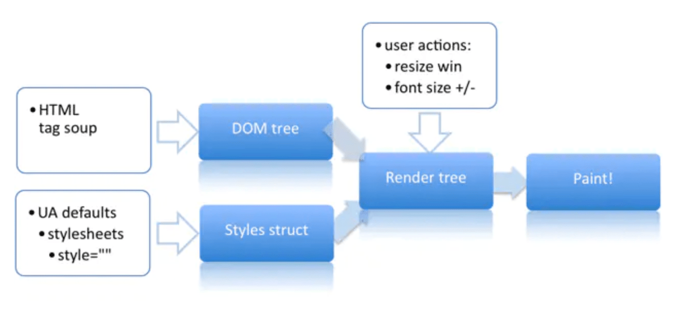

# HTML

## HTML的元素都有哪些

块级元素

html body head header footer section style link meta p h1-h6 article ul li ol table span center pre hr menu nav aside dl dt dd tbody theader form

行内元素：

button input a span td import b img strong

## HTML的全局属性

* accesskey: 设置快捷键
* class: 为元素设置类标识
* contenteditable: 指定元素内容是否可编辑
* contextmenu: 自定义鼠标右键弹出上下文菜单内容（仅firefox支持）
* data-\*: 为元素增加自定义属性
* dir：设置元素文本方向（默认ltr；rtl）
* draggable: 设置元素是否可拖拽
* dropzone: 设置元素拖放类型（copy\|move\|link,H5新属性，主流均不支持）
* hidden: 规定元素仍未或不在相关
* id: 元素id，文档内唯一
* lang: 元素内容的语言
* spellcheck: 是否启动拼写和语法检查
* style: 行内css样式
* tabindex: 设置元素可以获得焦点，通过tab导航
* title: 规定元素有关的额外信息
* translate: 元素和子孙节点内容是否需要本地化（均不支持）

## HTML5 文件离线存储

* [有趣的HTML5：离线存储 manifest.appcache](https://segmentfault.com/a/1190000000732617)
* [IndexedDB - 一种在用户浏览器中持久存储数据的方法。](https://developer.mozilla.org/zh-CN/docs/Web/API/IndexedDB_API/Using_IndexedDB)

## 浏览器渲染页面步骤

* 下载文件

Attachment:

* 渲染引擎解析 HTML 文件构建 DOM 树
* 渲染引擎使用 CSS 解析器 构建 CSSOM 树。
  * DOM 树 根节点为 documentElement
* DOM树 和 CSSOM树 关联起来构成渲染树（RenderTree）. 
  * 渲染树类似DOM树，但并不是一一对应的，比如 display:none 的就不会包含在DOM树中，还有就是Head之类的所有在其中不可见的元素也是一样。另外 DOM元素在渲染树中也可能存在很多个节点。
  * 渲染树上的每一个节点称谓 frame 或者一个 box，每一个节点都有CSS box 的属性。
  * 渲染树的跟节点是包含所有其他元素的 frame/box。可以理解为限制在浏览器页面范围内的窗口区域。就是从视窗范围内页面\(0, 0\)到\(window.innerWidth, window.innerHeight\)的矩形显示区域
* 重排 和 重绘



## 重排 和 重绘

* 重排：部分渲染树（或整个）需要重新计算分析并且节点尺寸需要重新计算  
* 重绘：由于节点的几何属性发生改变或者由于样式发生改变，例如改变元素背景色，屏幕上的部分内容需要更新

### 什么情况会触发重排 和 重绘

* 添加、删除、更新 DOM 节点
* 通过 display: none 隐藏一个DOM节点 - 触发重排和重绘
* 通过 visibility: hidden 隐藏一个DOM节点 - 只触发重绘 （没有几何变化）
* 移动或者给页面中的 DOM节点添加动画
* 添加一个样式表、调整样式属性
* 用户行为（如调整浏览器窗口大小，改变字号，或者滚动等）

```javascript
var bstyle = document.body.style; // cache
bstyle.padding = "20px"; // 重排+重绘
bstyle.border = "10px solid red"; // 另一次重排+重绘
bstyle.color = "blue"; // 没有尺寸变化，只重绘
bstyle.backgroundColor = "#fad"; // 重绘
bstyle.fontSize = "2em"; // 重排+重绘
// 新的DOM节点 - 重排+重绘
document.body.appendChild(document.createTextNode('dude!'));
```

一些重排可能开销更大。想象一下渲染树，如果你直接改变body下的一个子节点，可能并不会对其它节点造成影响。但是当你给一个当前页面顶级的div添加动画或者改变它的大小，就会推动整个页面改变-听起来代价就十分高昂

[参考](https://juejin.im/entry/582f16fca22b9d006b7afd89)

### 那些操作会使浏览器立即重排

* offsetTop, offsetLeft, offsetWidth, offsetHeight
* scrollTop/Left/Width/Height
* clientTop/Left/Width/Height
* getComputedStyle\(\), or currentStyle in IE

### 如何最小化重排重绘

* 不要逐个改变样式，通过改变类名
* 使用离线操作，凑够一堆样式修改后统一重排重绘 documentFragment
* 不要频繁的获取、计算样式，更不要 set get同时进行
* Copy element 然后在 element 的副本上进行修改后，在正式的标签进行替换
* 通过 display none 隐藏元素后进行足够多的操作后，在显示。

