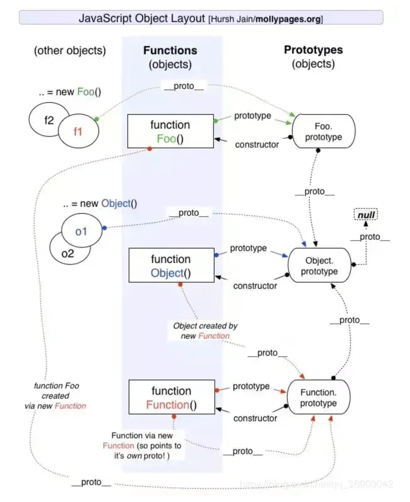
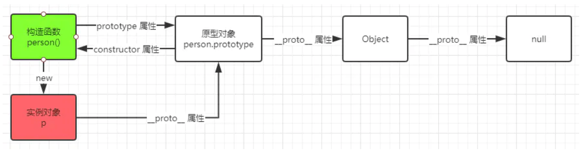
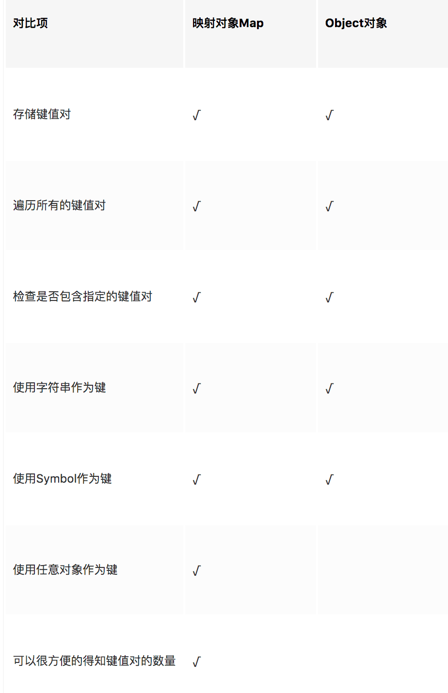
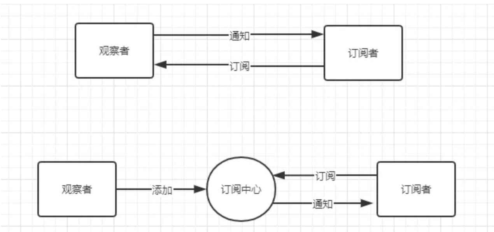

# JavaScript

### JS 原型链



JavaScript因其动态的特性，并不提供一个类似Java 或 C++一样的 class 实现。（ES6 中增加的Class 关键字只是语法糖，其本质还是依靠原型链实现）.JavaScript 继承的时候只有一种结构 —— 对象.

原型就是一个模版，一个对象的模型，当我们访问一个对象属性的时候，如果这个对象内部不存在这个属性，那么他就会去 prototype 里找这个属性，这个 prototype 又会有自己的 prototype，于是一直这样找下去。就是利用原型让一个引用类型继承另一个引用类型的属性和方法

每一个对象都有一个私有属性**proto**，指向这个对象的原型对象 prototype。该原型对象也有一个自己的原型对象 `__proto__` 层层向上直到 `Object` 对象原型为 `null`。

**JS获取原型的方法**

* p.**proto**
* p.constructor.prototype
* Object.getPrototypeOf\(p\)



对于实例对象来说，原型链的作用：

* 实现继承
* 属性查找
* 实例类型判断：是否属于某类对象

**构造方法**

构造方法就是一个可以被 new 的方法（箭头函数不能被 new）

实现一个模拟的 `new`

```javascript
function ObjectFactory () {
  const constructor = [].shift.call(arguments)
  const res = {}
  res.__proto__ = constructor.prototype
  const ret = constructor.apply(res, arguments)
  return typeof ret === 'object' ? ret : res
}
```

#### 创建对象有几种方法

* 字面量
* 通过构造函数 `new`
* 通过 `Object.create` 创建的新对象是使用原型链来连接的，即把新对象的 `__proto__` 属性设置为参数

#### 原型、构造函数、实例、原型链


构造函数 通过 `new` 生成对象实例，构造函数的 `prototype` 属性与原型对象关联，实例对象的 `__proto__` 与原型对象所关联，而所有的对象终的原型对象都是 `Object`。

#### instanceof


只要是在原型链上的，都会被 `instanceof` 看作是实例对象的构造函数。

#### new 运算符

1. 一个新对象被创建，它继承自 `foo.prototype`。
2. 构造函数 `foo` 被执行，执行的时候，相应的传参会被传入，同时上下文 `this` 会被指定为这个新实例。`new foo` 等同于 `new foo()`，只能用在不传递任何参数的情况。
3. 如果构造函数返回了一个对象，那么这个对象会取代整个 `new` 出来的结果。如果没有返回对象，那么 `new` 出来的结果为步骤1创建的对象。

```javascript
var new2 = function(func) {
    var o = Object.create(func.prototype);
    var k = func.call(o);
    if (typeof k === 'object') {
        return k;
    }

    return o;
}
```

### typeof、instanceof、toString 的区别

三种都是JS中用于获取数据类型的方法

**typeof**

用于比较基础数据类型和引用类型，返回值有 "number"、"string"、"boolean"、"null"、"function"、"undefined"、"symble"、"object" 原子类型字符串、数值、布尔值的typeof运算返回相应的类型值；而合成类型中只有函数的typeof运算返回‘function’，其他都返回‘object’。两个特殊值里， typeof undefined 为 ‘undefined’，而typeof null 为 ‘object’。

**instanceof**

用来判断一个对象是否为某个构造函数的实例。值得注意的是原子类型的值不是对象，所以不能用instanceof。对原型链中的 `__proto__` 逐层向上进行查找，通过instanceof 可以判断一个事例的父类型 和祖先类型的实例

**toString**

要想区别对象、数组、函数单纯使用 typeof 是不行的。null 和Array 的结果也是 object，有时候我们需要的是 "纯粹" 的 object 对象。

```javascript
Object.prototype.toString.call(2); // "[object Number]"
Object.prototype.toString.call(''); // "[object String]"
Object.prototype.toString.call(true); // "[object Boolean]"
Object.prototype.toString.call(undefined); // "[object Undefined]"
Object.prototype.toString.call(null); // "[object Null]"
Object.prototype.toString.call(Math); // "[object Math]"
Object.prototype.toString.call({}); // "[object Object]"
Object.prototype.toString.call([]); // "[object Array]"
```

[拓展阅读](https://juejin.im/post/5c0224c1f265da611d666514)

### undefined 与 undeclared 的区别？

* undefined: 已在作用域中声明但还没有赋值的变量
* undeclared: 还没有在作用域中声明过的变量

### null 和 undefined 的区别？

Undefined 和 Null 都是基本数据类型，这两个基本数据类型分别都只有一个值，就是 undefined 和 null。

* undefined：代表的含义是未定义，一般变量声明了但还没有定义的时候会返回 undefined
* Null：代表的含义是空对象，null 主要用于赋值给一些可能会返回对象的变量，作为初始化

### 数据类型

* 基本类型：Null Undefined Number String Bigint Symbol Boolean
* 引用类型：Object

基础类型 储存在栈内存中 \| 大小是固定 \| 在栈中可以快速查找 \| 对值操作 引用类型 储存在堆内存中 \| 大小不固定 \| 栈内存储存内存地址 \| 对地址操作

### 类型转换

#### 显式类型转换

Number\(\)

#### 隐式类型转换

* 四则运算
* 判断语句
* Native 调用

### NaN 指的是什么

NaN 属性代表非数字值的特殊值，该 属性用于表示某值不是数字

```javascript
typeof(NaN) // "number"
NaN == NaN // false
```

### 什么是包装对象

包装对象，只要是为了便于基本类型调用对象的方法。String Boolean Number

### 什么是作用域链

作用域链分为两种

* 全局作用域：绑定在 window 上，为全部作用域链 的最顶层
* 函数作用域：函数执行的时候有一个执行栈，并创建执行环境即执行上下文对象，上下文对象中有一个大对象，保存函数执行的时候所有可能用到的变量/函数，在使用变量时就会访问这个大对象，这个对象随着函数的调用而创建，随着函数的执行结束出栈而销毁，这个大对象组成的链就叫作用域链。

```javascript
function test() {
    for (var index = 0; index < 3; index++) {
        setTimeout(() => {
            console.log('index:' + index)
        })
    }
}

test() 
//  index:3
//  index:3
//  index:3
```

因为JS 的时间循环机制，定时器的回调肯定在循环结束后执行，那时候index已经等于3了。

### 写一个方法把下划线命名转换成大驼峰命名

```javascript
function toCamel(str) {
  str = str.replace(/(\w)/, (match, $1) => `${$1.toUpperCase()}`)
  while(str.match(/\w_\w/)) {
    str = str.replace(/(\w)(_)(\w)/, (match, $1, $2, $3) => `${$1}${$3.toUpperCase()}`)
  }
  return str
}
```

### 去掉字符串最后一个指定字符

```javascript
const removeLastTarget = (str, target) => {
  const tmpArr = str.split('')
  tmpArr.splice(str.lastIndexOf(target), target.length)
  return tmpArr.join()
}
```

方法二

```javascript
String.prototype.reverse = function () {
  return this.split('').reverse().join('')
}

String.prototype.removeFirstChar = function (m) {
    return this.replace(m, '')
}

const string = 'emamam, your string'
const removedChar = 'm'
string.reverse().removeFirstChar(removedChar).reverse()
```

### 闭包的作用

闭包即通过函数嵌套等方式保证函数内外的作用域隔离，以是的函数内部的变量等信息只能在内部读取，并且外部的变量不影响内部。

* 可以创建私有变量，并通过在外部调用闭包函数访问函数内部的变量。
* 使已经运行结束的函数上下文中的变量对象继续留在内存中。

**特性**

* 函数嵌套函数
* 函数内部可以引用函数外部的参数和变量（由于链式作用域）
* 参数和变量不会被垃圾回收机制回收

**闭包常见用途**

* 创建特权方法用于访问控制
* 事件处理程序及回调

**优缺点**

* 优点：在内存中维持了一个变量，由于闭包，无法通过其他途径访问，从而达到保护变量安全的效果
* 缺点：参数和变量不会被垃圾回收机制回收

### Let、Var 和 const 的区别

* var: 解析器在解析js的时候，会将脚本都扫描一遍，将变量的生命提前到代码块的顶部，赋值还是在原先的为止，若在赋值前使用，就会出现展示性死区 undefined
* let: 声明只在当前代码块内，var 的声明会被提升到全局中
* const: 不可重复声明

**为什么 var 可以重复声明**

编译器会对代码进行拆解，他会使用LHS 和 RHS 查询解析 = 左右两边的代码。当引擎执行 `var head = 2`的时候，他会首先执行 `var head` 声明变量，声明时会到作用域中查找是否有 `head` 这个变量，如果没有，则新建一个变量命名为 `head`。如果有，则将变量赋值为2 [参考](https://www.cnblogs.com/neil080320/p/6529679.html)

### 数据属性 和 访问器属性的区别

Object.defineProperty

1. 数据属性（数据描述符）
2. \[\[Configurable\]\]：表示能否通过 delete 删除属性从而定义属性，能否修改属性的特征，或者 能否把属性修改为访问器属性
3. \[\[Enumerable\]\]: 表示能否通过 for-in 循环
4. \[\[value\]\]: 属性值

```javascript
var p = {
    name:'dage'
}
Object.defineProperty(p,'name',{
    value:'xxx'
})
p.name = '4rrr'
console.log(p.name) // 4rrr
Object.defineProperty(p,'name',{
    writable:false,
    value:'again'
})
p.name = '4rrr'
console.log(p.name) // again
```

1. 访问器属性

可以理解为取值和赋值前的拦截器

\[\[Enumerable\]\]：表示能否通过 for-in 循环返回属性，默认 false

\[\[Get\]\]：在读取属性时调用的函数。默认值为 undefined

\[\[Set\]\]：在写入属性时调用的函数。默认值为 undefined

```javascript
var p = {
    name:''
}
Object.defineProperty(p,'name',{
    get:function(){
        return 'right yeah !'
    },
    set:function(val){
        return 'handsome '+val
    }
})
p.name = `xiaoli`
console.log(p.name) // right yeah !
```

### toString 和 valueOf

```javascript
let o = function () {
    this.toString = () => {
        return 'my is o,'
    }
    this.valueOf = () => {
        return 99
    }
}
let n = new o()
console.log(n + 'abc') // 99abc
console.log(n * 10) // 990
// 有没有很酷炫
```

当这两个函数同时存在时候，会先调用 valueOf ，若返回的不是原始类型，那么会调用 toString 方法，如果这时候 toString 方法返回的也不是原始数据类型，那么就会报错 TypeError: Cannot convert object to primitive value 如下

### 箭头函数与普通函数的区别

* 箭头函数在浏览器中没有 `arguments` 对象，在 node 中有 `arguments` 但是只能获取到长度
* `this` 指向不一样
* 不能使用 `new` 关键字，即不能作为构造函数

### JS 处理二进制

ArrayBuffer：用来表示通用的长度固定的二进制缓冲区，作为内存区域，可以存放多种类型的数据，他不能直接读写，只能通过视图类读写。

### 异步有哪些解决方案

* 回调函数：通过嵌套调用实现
* Generator：异步任务的容器，生成器本质上是一个特殊的迭代器，Generator 执行后返回一个指针对象，调用该对象的next 方法将指针移动到下一个位置。返回一个对象 {value: 执行结果, done: 是否结束}
* Promise
* GO：Generator + Promise
* async/await

### CO库

co 用 promise 的特性，将 Generator 包裹在 Promise 中，然后循环执行 next 函数，把 next 函数返回的的 value 用 promise 包装，通过 then.resolve 调用下一个 next 函数，并将值传递给 next 函数，直到 done 为 true，最后执行包裹 Generator 函数的 resolve。

### JS 事件循环

**解答1**

* [js事件循环](https://cloud.tencent.com/developer/article/1332957)

事件循环的主要部分有 一个栈、两个队列、一套幕后线程。

开始的时候，执行栈中会执行全部的同步代码，同步代码中如果有异步函数调用如 setTimeout、http请求等，会将对应的请求放到幕后线程去处理。当幕后线程处理完异步请求，比如setTimeout 的时间到了，或者http请求获得响应，并且当执行栈中全部执行完毕（为空），会触发一次事件循环，将执行宏任务队列中第一个任务，任务执行完毕，执行微任务队列中的全部任务。微任务队列全部执行完成为空后，事件循环再次启动，执行下一个宏任务。如果当前任务队列为空，他会一直循环等待任务的到来，这就叫任务循环

* 宏任务（比较大型的工作）：setTimeout setInterval 用户交互操作 UI渲染
* 微任务（比较小型的工作）：Promise process.nextTick

**解答2**

1. 首先js 是单线程运行的，在代码执行的时候，通过将不同函数的执行上下文压入执行栈中来保证代码的有序执行。
2. 在执行同步代码的时候，如果遇到了异步事件，js 引擎并不会一直等待其返回结果，而是会将这个事件挂起，继续执行执行栈中的其他任务
3. 当同步事件执行完毕后，再将异步事件对应的回调加入到与当前执行栈中不同的另一个任务队列中等待执行。
4. 任务队列可以分为宏任务对列和微任务对列，当当前执行栈中的事件执行完毕后，js 引擎首先会判断微任务对列中是否有任务可以执行，如果有就将微任务队首的事件压入栈中执行。
5. 当微任务对列中的任务都执行完成后再去判断宏任务对列中的任务。

### CommonJS 中的 require/exports 和 ES6 中的 import/export 有何区别

* CommonJS 的 require 加载时执行，缓存本地，而import 在执行时执行，不会缓存
* CommonJS 的 module 代表整个模块，`module.exports` 代表模块的输出，所以在 require 的时候实际上 require 的是 module 的 exports 属性

    export 命令是对外的接口，必须与模块内部变量建立一对一关系。

### 一行代码实现数组去重

```javascript
[...new Set([1,2,33,2,1,2,33])]
```

### 如何判断两个对象相等

1. 递归遍历
2. JSON.stringify

### 前端性能优化

* 算法优化
* CDN
* 图片压缩
* 使用浏览器缓存
* 图片懒加载
* 页面滚动加载
* JS、CSS、HTML 等文件压缩
* 开启web服务器的 gzip
* 使用 nginx 反向代理
* 减少 DOM 操作

### Object.defineProperty\(obj, prop, descriptor\)

* obj 对象
* prop 要定义活修改的属性的名称
* descriptor 将定义活修改的属性描述符

### Set 与 数组 的区别

* 数组是有序的列表，Set 是无序的
* Set 成员值都是唯一的

Set中的对象引用都是强化类型，并不会允许垃圾回收，ES6中引入 WeakSet，允许从内存中清除不再需要的被这些集合所引用的对象。

### Set 和 Map  的区别

* Set 类似数组，不过他的所有成员值都是唯一的
* Map 类似对象，是键值对，但是键的范围不限于字符串，各种类型的值都可以作为键

### Object、Map 的区别



### WeakMap 和 Map 的区别

* Map 的键可以是任意类型，而 WeakMap 的键只能是 对象类型
* WeakMap 不能包含无引用对象，如果没有引用，则会被垃圾回收立即清除
* WeakMap 对象不可枚举，无法获取大小

### JS 防抖和节流 debounce Throttle

Debounce 防抖：在事件最后一次触发 n 毫秒之内执行事件，不管事件曾被触发过多少次。 Throttle 节流：事件在第一次触发后 n 毫秒内，不论事件是否继续被触发，都执行。

* [参考](https://juejin.im/entry/59aacd04518825242c423fa0): 浅谈throttle以及debounce的原理和实现

#### 代码实现

```javascript
const base = function (fn, wait, debounce) {
  let timer
  return function() {
    let context = this, args = arguments
    if (debounce && timer) clearTimeout(timer)
    if (debounce || !timer) {
      timer = setTimeout(function () {
        timer = null
        fn.apply(context, args)
      }, wait)
    }
  }
}

const debounce = function (fn, wait) {
  base(fn, wait, true)
}

const throttle = function (fn, wait) {
  base(fn, wait, false)
}
```

### Promise

**promise是同步还是异步的？**

* promise本身是同步的
* promise的回调then是异步的

**状态**

* pending: 等待
* fulfilled：执行
* onRejected：拒绝

状态只在第一次修改时有效，之后状态 immutable

**基本过程**

* 初始化一个Promise对象的时候，状态为pending，会立即执行传入的参数
* 传入的方法有两个参数  onFulfilled 和 onReject
* 执行 then 函数注册回调处理数组
* Promise 里的关键是必须保证，then方法传入的参数，必须在then方法被调用的那一轮事件循环之后的新执行栈中执行

#### 代码实现

**构造函数**

```javascript
function Promise(fn) {
  this._state = 0
  this._value = null
  this._defereds = []

  try {
    fn(value => {
      resolve(this, value)
    }, reason => {
      reject(this, reason)
    })
  } catch(e) {
    reject(this, e)
  }
}
```

**then 方法**

* 实力化空的 `Promise` 对象用来返回
* 构造 `then(..)` 注册回调处理函数结构体
* 判断当前 `promise` 状态，`pending` 状态存储延迟处理对象 `deferred`，非 `pending` 状态执行 `onResolve` / `onReject` 回调

```javascript
Promise.prototype.then = function(onResolved, onRejected) {
  const res = new Promise(function() {})
  var deferred = new Handler(onResolved, onRejected, res)

  if (this._state === 0) {
    this._defereds.push(deferred)
    return res
  }

  handleResolved(this, deferred)
  return res
}
```

**QA: 为何要返回新的Promise 对象：因为在then 中会改变Promise的状态，但是Promise对象的状态应该是不可改变的**

* handleResolved： 根据当前 `Promise` 的状态，异步执行 `resolve` 活 `reject`

**Handler 函数封装存储 onResolved onRejected 函数和新生成 promise 对象**

```javascript
function Handler(onResolved, onRejected, promise) {
  this.onResolved = typeof onResolved === 'function' ? onResolved: null
  this.onRejected = typeof onRejected === 'function' ? onRejected: null
  this.promise = promise
}
```

**Resolve 函数**

resolve\(promise, x\)

* 如果 `Promise` 和 `x` 指向同一个对象，则忽略
* 如果 `x` 为 `Promise`，则使得 当前 `promise` 接受 `x` 的状态
* 如果 `then` 是函数，将 `x` 作为函数的作用域 `this` 调用
* 如果 `x` 不为对象或函数，以 `x` 为参数执行 `promise`

```javascript
function resolve(data) {
  function fn() {
    const { then } = data
    if (then && typeof then === 'function' ) {
      then.call()
    }
  }

  setTimeout(fn, 0)
}
```

### CommonJS / AMD / CMD / ES6

#### CommonJS

NodeJS 是 CommonJS 规范的主要实践者，以同步的方式加载模块。在服务器端，模块文件都存在本地磁盘，读取非常快所以不会出问题。

四个重要变量对模块化提供支持:

* `module`: 代表模块
* `exports`：module.exports 代表模块输出
* `require`：引入模块
* `global`：全局

#### AMD 和 require.js

AMD 采用异步方式加载模块，模块的加载不影响它后面的语句运行，所有依赖与这个模块的语句都定义在一个回调函数中，等加载完成后，这个回调函数才会运行。

require.js 的 AMD 实现

* require.config\(\) 指定引用路径
* define\(\) 定义模块
* require\(\) 引入模块
* require.config\(\)

#### CMD 和 sea.js

CMD 是另一种js模块化方案，它与AMD很类似，不同点在于：AMD 推崇依赖前置、提前执行，CMD推崇依赖就近 、延迟执行。

```javascript
// AMD
define(['a', 'b', 'c'], function(a, b, c) {

})

//  CMD
define(function(require, exports, module) {
    var a = require('./a');
})
```

#### ES6 Module

ES6 在语言层面实现了模块功能，用起来非常简单，主要由两个命令构成 export 和 import

ES6 与 CommonJS 模块的差异

1. CommonJS输出 的 是值的拷贝 ES6 模块输出的是引用
2. CommonJS 模块是运行时加载，ES6是编译时输出接口

## 面向对象

### 类的声明

```javascript
function Animate() {
    this.name = "name"
}

class Animate2 {
    constructor() {
        this.name = name
    }
```

### 如何实现继承

继承就是原型链

#### 借助构造函数实现继承

```javascript
function Parent() {
    this.name = 'parent';
}

function Child() {
    Parent1.call(this);
    this.type = 'child';
}
```

缺点：Parent 上的方法是没办法实现继承的

#### 借助原型链实现继承

```javascript
function Paren1() {
    this.name = 'parent';
}

function Child() {
    this.type = 'child';
}

Child2.prototype = new Parent();
```

prototype 是子类构造函数的一个属性，是一个对象，`new Child().__proto__` === `Child.prototype`

缺点：父类中的属性是所有对象共享的。

#### 组合继承

```javascript
function Parent() {
    this.name = 'parent'
}

function Child() {
    Parent.call(this)
    this.type = 'child3';
}

Child.prototype = new Parent();
```

缺点：父级构造函数执行了两次

#### 组合继承优化

```javascript
function Parent() {
    this.name = 'parent'
}

function Child() {
    Parent3.call(this)
    this.type = 'child';
}

Child.prototype = Parent.prototype;
```

#### 组合继承优化的优化

```javascript
function Parent() {
    this.name = 'parent'
}

function Child() {
    Parent3.call(this)
    this.type = 'child';
}

Child.prototype = Object.create(Parent.prototype);
Child.prototype.constructor = Child;
```

## ES6

### ES6 在字符串层面做了哪些优化

1. 优化：增加了字符串模版 \`AA${aa}AA\`
2. 升级：增加了 inclouds\(\) 方法及 startsWith endsWith padStart padEnd repeat

### ES6 的 Proxy

Proxy 用来改变JS 默认的一些语言行为，包括拦截默认的 get/set 方法，使的 JS 的使用自由度更高

```javascript
function createMyOwnObj() {
  return new Proxy({}, {
    get(target, propKey, receiver) {
      return new Promise((resolve, reject) => {
        setTimeout(() => {})
      })
    } 
  })
}

let myObj = createMyOwnObj()

myObj.hahaha.then(result => {
    console.log(result) //你的hahaha运气不错，成功了
}).catch(error => {
    console.log(error) //你的hahaha运气不行，失败了
})
```

### ES6 的 Reflect

### Iterator 是什么

Set/Map 不能使用 for 循环遍历，为了实现遍历，官方提供一个Iterator 接口

Iterator标准的具体实现是Iterator遍历器。Iterator标准规定，所有部署了key值为\[Symbol.iterator\]，且\[Symbol.iterator\]的value是标准的Iterator接口函数\(标准的Iterator接口函数: 该函数必须返回一个对象，且对象中包含next方法，且执行next\(\)能返回包含value/done属性的Iterator对象\)的对象，都称之为可遍历对象，next\(\)后返回的Iterator对象也就是Iterator遍历器。

```javascript
let obj = {
  data: ['hello', 'world'],
  [Symbol.iterator]() {
    const self = this
    let index = 0
    return {
      next() {
        if (index < self.data.length) {
          return {
            value: self.data[index++],
            done: false
          }
        } else {
          return { value: undefined, done: true }
        } 
      } 
    }
  }
}
```

### Class / extends 有什么用

ES6 的 class 可以看作只是一个 ES5生成实例对象的构造函数的语法糖，让对象原型写法更清晰，对象是梨花是一种面向对象编程。Class 类 可以通过 extends 实现继承。

* 类内部定义的所有方法都是不可枚举的
* ES6 的 class 类必须用 new 命令操作
* ES6 的 class 类不存在变量提升，必须先定义class 之后才能实例化
* ES5 的继承，实质是创造子类的实例对象 this，然后在将父类的属性和方法，加到this 上。ES6 的继承机制完全不同，实质是先将父类实例对象的属性和方法，加到this上面，（所以必须先调用super 方法），然后在用子类的构造函数修改 this

### Generator

Generator 是 ES6 提供的一种异步编程解决方案，可以理解为是一个状态机，内部封装了多个状态/

执行Generator 会返回一个遍历器对西那个，也就是说，Generator 函数除了状态机，还是一个遍历器对象生成函数。返回的遍历器对象，可以依次遍历 Generator 函数内部的每一个状态。

特征

* function关键词与函数名之间有 \*
* 函数体内部使用 yield  变大时，定义不同的内部状态 （yield 产出）

```javascript
function* helloWorldGenerator() {
  yield 'hello';
  yield 'world';
  return 'ending';
}

var hw = helloWorldGenerator();
```

`helloWorldGenerator` 函数有 `hello`、`world` 及 `ending` 三个状态。

调用 `Generator` 函数后，该函数 并不执行，返回的 也不是函数运行结果，而是指向内部状态的指针对象，也就是 `Iterator`。必须调用 `next` 方法使指针移动到下一个状态。也就是，每次调用next 方法，内部指针就 从函数头部或上一次 停下来的地方开始执行，直到遇到下一个 `yield` 或 `return` 为止

**与 Iterator 接口的关系**

```javascript
var myIterable = {};
myIterable[Symbol.iterator] = function* () {
  yield 1;
  yield 2;
  yield 3;
};

[...myIterable] // [1, 2, 3]
```

**next 方法的参数**

yield 表达式本身没有返回值，或者说总是返回 undefined。next 方法可以带一个参数，该参数会被当作上一个 yield 表达式的返回值。

### for...of

for...of 在可迭代对象 \(Array, Map, Set, String, TypedArray, arguments, Generator, Iterator\) 上创建一个迭代循环，调用自定义迭代 钩子，并未不同属性 的值执行 语句

[参考 MDN for...of](https://developer.mozilla.org/zh-CN/docs/Web/JavaScript/Reference/Statements/for...of)

### for...of 与 for...in 的区别

* `for...in` 语句以任意顺序迭代对象 的可枚举属性

  -`for...of` 语句遍历可迭代对象定义迭代数据

```javascript
Object.prototype.objCustom = function() {}; 
Array.prototype.arrCustom = function() {};

let iterable = [3, 5, 7];
iterable.foo = 'hello';

for (let i in iterable) {
  console.log(i); // logs 0, 1, 2, "foo", "arrCustom", "objCustom"
}

for (let i in iterable) {
  if (iterable.hasOwnProperty(i)) {
    console.log(i); // logs 0, 1, 2, "foo"
  }
}

for (let i of iterable) {
  console.log(i); // logs 3, 5, 7
}
```

### 线程和 进程的区别

## 函数式编程

### 柯里化 Currying

> 柯里化 是把接受多个参数的函数变成接受一个单一参数（最初函数的第一个参数）的函数，并返回接受余下的参切返回结果的心函数的技术

特点

* 参数复用
* 业务解偶 调用时机灵活
* 延迟执行 部分求值

```javascript
let curry2 = (fn, ...args) => {
  let len = fn.length
  return (...rest) => {
    let allArgs = args.slice(0)
    console.log('allArgs:', allArgs, 'len:', len)
    allArgs.push(...rest)
    if (allArgs.length < len) {
      return curry2.call(this, fn, ...allArgs)
    } else {
      return fn.apply(this, allArgs)
    }
  }
}
```

### 线程和进程的区别

* 进程：一个动态过程，是一个活动的实体。简单来说，一个应用程序的运行可以看作是一个进程
* 线程：程序执行流的最小执行单位，是进程中的实际运作单位

### 什么是尾递归？

函数内部循环调用其自身的函数是递归函数。若函数没有执行完毕，执行栈中会一直保持着这个函数的相关变量，一直占用内存，当递归次数过大的时候，就可能会出现内存溢出，也叫爆栈，页面可能会卡死。所以为了避免出现这种情况，可以采用尾递归

尾递归：在函数调用最后一步调用函数，进入下一个函数不再需要上一个函数的环境了，内存空间O\(n\) 到 O\(1\) 的优化，这就是尾递归。尾递归的优势：可以释放外层函数的调用站，较少栈层级，节省内存开销，避免内存溢出。

### 观察者模式  和 发布-订阅模式的区别

两者都是订阅-通知的模式，区别在于：

观察者模式：观察者和订阅者是互相知道彼此的，是一个紧耦合的设计 发布-订阅：观察者和订阅者是不知道彼此的，因为他们中间是通过一个订阅中心来交互的，订阅中心存储来多个订阅者，当有新的发布的时候，就会通知订阅者



### Websocket

Websocket 是应用层协议，基于 TCP，与 HTTP 协议一样位于应用层，都是 TCP/IP 协议的子集

HTTP 协议是单向通讯，只有客户端发起HTTP请求，服务端才会返回数据。而 WebSocket 协议是双向通信协议，在建立链接后，客户端和服务器都可以主动向 对方发送或接受数据

### 参考资料

* [面试总结：javascript 面试点汇总](https://juejin.im/post/5e523e726fb9a07c9a195a95#heading-4)

### JS 事件委托？

事件委托 本质上是利用了浏览器事件冒泡的机制。因为事件在冒泡过程中会上传到父节点，并且父节点可以通过事件对象获取到目标节点，因此可以把子节点的监听函数定义在父节点上，由父节点的监听函数统一处理多个子元素的事件，这种方式称为事件代理。

使用事件代理我们可以不必要为每一个子元素都绑定一个监听事件，这样减少了内存上的消耗。并且使用事件代理我们还可以实现事件的动态绑定，比如说新增了一个子节点，我们并不需要单独地为它添加一个监听事件，它所发生的事件会交给父元素中的监听函数来处理。

Event对象提供了一个属性叫target，可以返回事件的目标节点，我们成为事件源，也就是说，target就可以表示为当前的事件操作的dom，但是不是真正操作dom，当然，这个是有兼容性的，标准浏览器用ev.target，IE浏览器用event.srcElement，此时只是获取了当前节点的位置，并不知道是什么节点名称，这里我们用nodeName来获取具体是什么标签名，这个返回的是一个大写的，我们需要转成小写再做比较

## DOM 事件类

#### 基本概念 DOM事件级别

| DOM事件类 | 事件级别 |
| :--- | :--- |
| DOM0 | element.onclick = function\(\) {} |
| DOM2 | element.addEventListener\('click', function\(\){}, false\) |
| DOM3 | element.addEventListener\('keyup', function\(\){}, false\) |

> addEventListener 的 第三个参数指示是冒泡阶段触发（false）还是捕获阶段触发（true）

DOM2 增加了 addEventListener 接口，DOM3 增加了 keyup 等很多事件类型。

#### DOM 事件模型 捕获和冒泡

* 捕获：从上层到下层
* 冒泡：从下层到上层

#### DOM 事件流 / 事件传播

当事件发生在DOM元素上时，该事件并不完全发生在那个元素上。

事件传播有三个阶段

* 捕捉阶段：事件从window开始，然后向下到每个元素，直到达到目标元素事件或 event.target
* 目标阶段：事件已经达到目标元素
* 冒泡阶段：事件从目标元素冒泡，然后上升到每个元素，直到到达window

#### DOM 事件捕获的具体流程

第一个接收事件的对象是window

window -&gt; document -&gt; html -&gt; body -&gt; ... -&gt; 目标元素

> HTML节点怎么获取？document.documentElement

冒泡流程反之。

#### Event 对象的常见应用

event 对象找到目标事件

```javascript
event.preventDefault() // 阻止默认事件 比如a标签的跳转
event.stopPropagation() // 阻止冒泡
event.stopImmediatePropagation() // 同一个节点上绑定了两个click，两个事件有顺序关系，如果执行这个方法，a被调用了之后b就不会被再次调用。
event.currentTarget // 表示当前绑定事件的元素
event.target // 表示被点击的元素
```

#### 自定义事件

```text
var event = new Event('custom');
event.addEventListener('cutom', function() {
    console.log('costom')
});

event.dispatchEvent(event);
```

自定义事件有两个类

Event 和 CustomEvent，Event 只能指定事件名，CustomEvent 可以指定事件名和数据。

### 实现 JS 深克隆

**浅克隆**

对象只会被克隆最外部的一层，至于更深层的对象，则依然是通过引用指向同一块堆内存

\`\`\`jsx harmony function copy\(obj\) { return { ...obj } }

function copy2\(obj\) { const res = {} for\(let key in obj\) { res\[key\] = obj\[key\] } return res }

```text
##### 深克隆

1. JSON.parse

```jsx harmony
let newObj = JSON.parse(JSON.stringify(obj))
```

问题:

* 无法实现对函数，RegExg 等特殊对象的克隆
* 会抛弃对象的 constructor，所有的构造函数会指向 Object
* 对象循环引用，会报错
* 构造一个深克隆函数

\`\`\`jsx harmony function deepCopy\(obj\) {

}

function \_deepCopy\(obj\) { let set = new Set\(\) let res = {} for \(let key in obj\) { if \(!obj.hasOwnProperty\(key\)\) return const item = obj\[key\] if\(set.has\(item\)\) continue set.add\(item\) if \(typeof item === 'object'\) { res\[key\] = deepCopy\(item\) continue }  
res\[key\] = item } return res }

```text
### 调用并改变函数执行上下文的三种方式

- bind: 事先把 函数上下文 改变成我们要想要的结果，并且把对应的参数值准备好，以后要用到了，直接的执行即可。也就是说bind可以改变this的指向，但不会马上的执行
- call: 改变函数上下文后立即执行，与apply 的区别的是call从第二个参数开始以参数列表的形式展现 `fn.call(this, 1, 2, 3)`
- apply: 改变上下文后立即执行，与call的区别在于apply从第二个参数开始 `fn.apply(this, [1, 2, 3])`

#### bind 函数实现

```js
Function.prototype.bind = function(oThis) {
  if (typeof this !== 'function') {
    throw new TypeError(`${this} is not callable`)
  }

  const arg = Array.prototype.slice(arguments, 1)
  const self = this
  const func = function() {}

  const bindFunc =  function () {
    // instanceof 为了防止 new 的时候报错
    return this.apply(this instanceof func ? self : oThis, arg.concat(arguments))
  }

  func.prototype = self.prototype
  bindFunc.prototype = new func()

  return bindFunc
}
```

#### Call 函数实现

```javascript
Function.prototype.call2 = function (context) {
    var context = context || window;
    context.fn = this;

    var args = [];
    for(var i = 1, len = arguments.length; i < len; i++) {
        args.push('arguments[' + i + ']');
    }

    var result = eval('context.fn(' + args +')');

    delete context.fn
    return result;
}

// 测试一下
var value = 2;

var obj = {
    value: 1
}

function bar(name, age) {
    console.log(this.value);
    return {
        value: this.value,
        name: name,
        age: age
    }
}

bar.call2(null); // 2

console.log(bar.call2(obj, 'kevin', 18));
```

#### apply的模拟实现

```javascript
Function.prototype.apply = function (context, arr) {
    var context = Object(context) || window;
    context.fn = this;

    var result;
    if (!arr) {
        result = context.fn();
    }
    else {
        var args = [];
        for (var i = 0, len = arr.length; i < len; i++) {
            args.push('arr[' + i + ']');
        }
        result = eval('context.fn(' + args + ')')
    }

    delete context.fn
    return result;
}
```

### 前端路由实现方式

#### Hash路由

Hash路由通过在地址中增加 `#path` 实现区分页面。当hash发生变化后改变对应组件

* `window.addEventListener('hashchange', this.refresh, false);`  监听路由变化
* location.hash.slice\(1\) 获取当前路由地址
* 创建 history 数组保存历史记录保证前进后退

#### HTML5 HistoryAPI

通过 HTML5新API `window.history` 的

* window.history.back\(\);       // 后退
* window.history.forward\(\);    // 前进
* window.history.go\(-3\);       // 后退三个页面
* pushState 用于在浏览历史中添加历史记录,但是并不触发跳转,此方法接受三个参数

    state:一个与指定网址相关的状态对象，popstate事件触发时，该对象会传入回调函数。如果不需要这个对象，此处可以填null。

    title：新页面的标题，但是所有浏览器目前都忽略这个值，因此这里可以填null。

    url：新的网址，必须与当前页面处在同一个域。浏览器的地址栏将显示这个网址。

* replaceState 

### 垃圾回收

一般来说没有被引用的对象就是垃圾，就是要被清除， 有个例外如果几个对象引用形成一个环，互相引用，但根访问不到它们，这几个对象也是垃圾，也要被清除。

V8 的垃圾回收机制基于分代回收，假定一个新生的对象容易早死，不死的对象会获得更久。基于此，V8将内存分为新生代和老生代

* 新生代：新创建的对象或只经历过一次垃圾回收的对象
* 老生代：经历过多次垃圾回收的对象

回收算法

* StopTheWorld： 在垃圾回收算法执行前，需要将应用逻辑咱提高，执行完回收之后在执行应用逻辑。目的在于解决应用逻辑与垃圾回收器看到的情况不一致的问题。
* Scavenge 算法：新生代对象主要通过 Scavenge 算法回收。Scavenge 采用 Cheney 算法：使用复制的方式进行垃圾回收，即将内存一分为二，即使用中空间 FROM 和 闲置空间 TO。过程如下
  * 从 FROM 空间分配对象，如果空间分满，则执行垃圾回收
  * 检查 FROM 空间的存活对象，若对象存活，则肩擦对象是否符合晋升到老生代的条件，符合则晋升，否则将对象从 FROM空间复制到TO 空间
  * 若对象不存活，则释放不存活对象的空间
  * 完成复制后，将 FROM 空间与 TO 空间进行角色翻转
* 引用计数
  * 最初级的垃圾收集算法。此算法把“对象是否不再需要”简化定义为“对象有没有其他对象引用到它”。如果没有引用指向该对象（零引用），对象将被垃圾回收机制回收。
* 标记清除
  * 假定一个跟对象（在JS中即全局对象）
  * 标记阶段：从根开始遍历所有对象，然后找这些对象引用的对象。并对这些对象进行标记
  * 清除阶段：从根开始，垃圾回收器将找到所有可以获得的对象和收集所有不能获得的对象，并清除那些不可获得的对象。
  * 比引用计数方法的优势在于循环引用对象也能清除（循环引用会断掉与根的链接）

