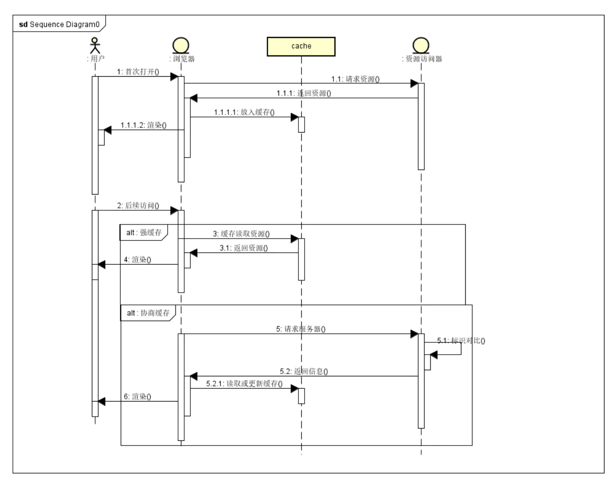
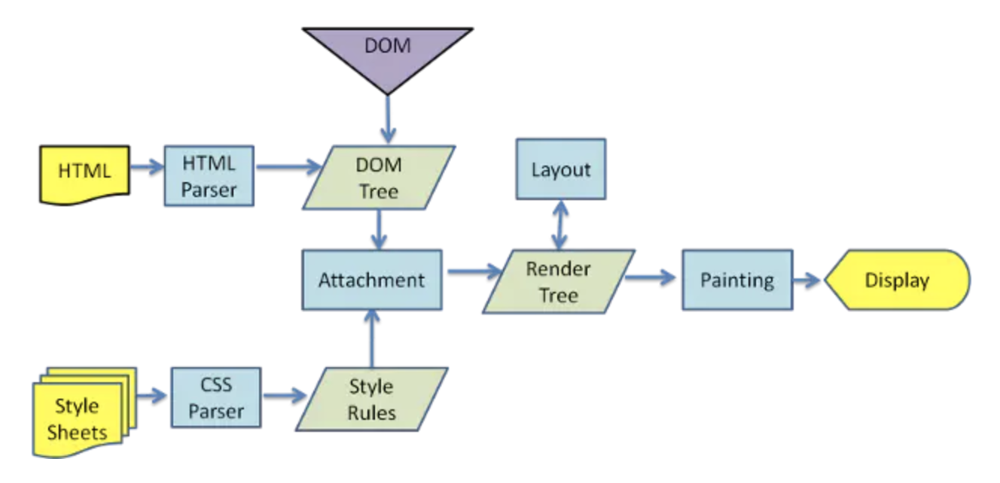

# 网络

### 从用户在浏览器输入地址到页面渲染完成期间 都发生了什么

1. 在浏览器地址栏输入URL
2. 浏览器查看缓存，如果请求资源在缓存中并且新鲜，跳转到转码步骤
3. 如果资源未缓存，发起新请求
4. 如果已缓存，检验是否足够新鲜，足够新鲜直接提供给客户端，否则与服务器进行验证。
5. 检验新鲜通常有两个HTTP头进行控制Expires和Cache-Control：
6. HTTP1.0提供Expires，值为一个绝对时间表示缓存新鲜日期
7. HTTP1.1增加了Cache-Control: max-age=,值为以秒为单位的最大新鲜时间
8. 浏览器解析URL获取协议，主机，端口，path
9. 浏览器组装一个HTTP（GET）请求报文
10. 浏览器获取主机ip地址，过程如下：
- 浏览器缓存
- 本机缓存
- hosts文件
- 路由器缓存
- ISP DNS缓存
- DNS递归查询（可能存在负载均衡导致每次IP不一样）

11. 打开一个socket与目标IP地址，端口建立TCP链接，三次握手如下：
12. 客户端发送一个TCP的SYN=1，Seq=X的包到服务器端口
13. 服务器发回SYN=1， ACK=X+1， Seq=Y的响应包
14. 客户端发送ACK=Y+1， Seq=Z
15. TCP链接建立后发送HTTP请求

16. 服务器接受请求并解析，将请求转发到服务程序，如虚拟主机使用HTTP Host头部判断请求的服务程序

17. 服务器检查HTTP请求头是否包含缓存验证信息如果验证缓存新鲜，返回304等对应状态码

18. 处理程序读取完整请求并准备HTTP响应，可能需要查询数据库等操作

19. 服务器将响应报文通过TCP连接发送回浏览器

20. 浏览器接收HTTP响应，然后根据情况选择关闭TCP连接或者保留重用，关闭TCP连接的四次握手如下：

21. 主动方发送Fin=1， Ack=Z， Seq= X报文

22. 被动方发送ACK=X+1， Seq=Z报文

23. 被动方发送Fin=1， ACK=X， Seq=Y报文

24. 主动方发送ACK=Y， Seq=X报文

25. 浏览器检查响应状态吗：是否为1XX，3XX， 4XX， 5XX，这些情况处理与2XX不同

26. 如果资源可缓存，进行缓存

27. 对响应进行解码（例如gzip压缩）

28. 根据资源类型决定如何处理（假设资源为HTML文档）

29. 解析HTML文档，构件DOM树，下载资源，构造CSSOM树，执行js脚本，这些操作没有严格的先后顺序，以下分别解释

##### 构建DOM树：

- Tokenizing：根据HTML规范将字符流解析为标记

- Lexing：词法分析将标记转换为对象并定义属性和规则

- DOM construction：根据HTML标记关系将对象组成DOM树

- 解析过程中遇到图片、样式表、js文件，启动下载

##### 构建CSSOM树：

- Tokenizing：字符流转换为标记流

- Node：根据标记创建节点

- CSSOM：节点创建CSSOM树

- 根据DOM树和CSSOM树构建渲染树:

- 从DOM树的根节点遍历所有可见节点，不可见节点包括：1）script,meta这样本身不可见的标签。2)被css隐藏的节点，如display: none

- 对每一个可见节点，找到恰当的CSSOM规则并应用

- 发布可视节点的内容和计算样式

##### JS解析流程

- 浏览器创建Document对象并解析HTML，将解析到的元素和文本节点添加到文档中，此时document.readystate为loading

- HTML解析器遇到没有async和defer的script时，将他们添加到文档中，然后执行行内或外部脚本。这些脚本会同步执行，并且在脚本下载和执行时解析器会暂停。这样就可以用document.write()把文本插入到输入流中。同步脚本经常简单定义函数和注册事件处理程序，他们可以遍历和操作script和他们之前的文档内容

- 当解析器遇到设置了async属性的script时，开始下载脚本并继续解析文档。脚本会在它下载完成后尽快执行，但是解析器不会停下来等它下载。异步脚本禁止使用document.write()，它们可以访问自己script和之前的文档元素

- 当文档完成解析，document.readState变成interactive

- 所有defer脚本会按照在文档出现的顺序执行，延迟脚本能访问完整文档树，禁止使用document.write()

- 浏览器在Document对象上触发DOMContentLoaded事件

- 此时文档完全解析完成，浏览器可能还在等待如图片等内容加载，等这些内容完成载入并且所有异步脚本完成载入和执行，document.readState变为complete,window触发load事件

##### 显示页面

HTML解析过程中会逐步显示页面

### 如何进行网站性能优化

1. Content方面

- 减少HTTP请求：合并文件、CSS精灵、inline Image

- 减少DNS查询：DNS查询完成之前浏览器不能从这个主机下载任何任何文件。方法：DNS缓存、将资源分布到恰当数量的主机名，平衡并行下载和DNS查询

- 避免重定向：多余的中间访问

- 使Ajax可缓存

- 非必须组件延迟加载

- 未来所需组件预加载

- 减少DOM元素数量

- 将资源放到不同的域下：浏览器同时从一个域下载资源的数目有限，增加域可以提高并行下载量

- 减少iframe数量

- 不要404

2. Server方面

- 使用CDN

- 添加Expires或者Cache-Control响应头

- 对组件使用Gzip压缩

- 配置ETag

- Flush Buffer Early

- Ajax使用GET进行请求

- 避免空src的img标签

3. Cookie方面

- 减小cookie大小

- 引入资源的域名不要包含cookie

4. Css方面

- 将样式表放到页面顶部

- 不使用CSS表达式

- 使用不使用@import

- 不使用IE的Filter

5. Javascript方面

- 将脚本放到页面底部

- 将javascript和css从外部引入

- 压缩javascript和css

- 删除不需要的脚本

- 减少DOM访问

- 合理设计事件监听器

6. 图片方面

- 优化图片：根据实际颜色需要选择色深、压缩

- 优化css精灵

- 不要在HTML中拉伸图片

- 保证favicon.ico小并且可缓存

7. 移动方面

- 保证组件小于25k

- Pack Components into a Multipart Document

### 浏览器缓存

浏览器缓存分为 `强缓存` 和 `协商缓存`



- 先根据这个资源给一些 http header 判断它是否被强缓存命中，如果被强缓存命中，则直接使用强缓存。
- 如果没有被强缓存命中，客户端会发送请求到服务器，服务器通过另一些 request header 验证资源是否被协商缓存命中，称为 http再认证，如果命中，服务器会将请求返回（不返回资源），告诉客户端直接从缓存中获取。
- Ctrl + F5 强制刷新，浏览器会忽略所有的强缓存 和 协商缓存
- F5 刷新，浏览器会跳过强缓存，检查协商缓存。

##### 强缓存

- Expires: 缓存过期时间 GMT格式的时间字符串
- Cache-Control: 通过指令来实现缓存机制
    - max-age: 强缓存的有效时间（单位秒）。
    - no-cache: 不使用本地缓存，需要缓存与服务器协商，确认是否改变，如果之前的响应中存在 ETag，那么请求的时候会与服务器验证，如果资源未被更改，则可以避免重新下载
    - no-store: 直接禁止浏览器缓存数据，每次用户请求资源，都会向服务器发送一个请求，每次都会下载完整的资源。
    - public：可以被所有的用户缓存，包括终端用户和 CDN 代理服务器
    - private：只能被终端用户的浏览器缓存，不允许CDN等中继缓存服务器对其缓存
    
##### 协商缓存

response header 里面的设置：

```
etag: '5c20abbd-e2e8'
last-modified: Mon, 24 Dec 2018 09:49:49 GMT
```

- ETag：表示资源内容的唯一标识，随服务器response返回
- Last-Modify：资源最后更新时间，随着服务器response返回
- If-Modified-Since：通过比较两个时间来判断资源在两次请求期间是否有过修改，如果没有修改，则命中协商缓存
- If-None-Match：服务器通过比较请求头部的 If-None-Match 与 当前资源的 ETag 是否一致来判断资源是否在两次请求之间有过修改，如果没有修改，则命中协商缓存

###### 没过期资源：

发请求-->看资源是否过期-->过期-->请求服务器-->服务器对比资源是否真的过期-->没过期-->返回304状态码-->客户端用缓存的老资源。

###### 过期资源

发请求-->看资源是否过期-->过期-->请求服务器-->服务器对比资源是否真的过期-->过期-->返回200状态码-->客户端如第一次接收该资源一样，记下它的cache-control中的max-age、etag、last-modified等。

##### 304 Not Modified

304 Not Modified 说明无需再次传输请求内容，也就是说可以使用缓存内容。再是通常在一些安全方法 GET HEAD 或在请求 中附带了头部信息： If-None-Match 或 If-Modify-Since。

如果 200 OK，响应会带有头部 Cache-Control，Content-Location，Date，ETag，Expires， Vary

##### 浏览器缓存存放位置

可看到有两个来源：

- memory cache：内存中读取
- disk cache：硬盘中读取

内存当然要比硬盘读取快，为啥会有存放硬盘呢？

### PWA

PWA （Progressive web apps 渐进式Web应用），运用现代的Web API 以及传统的渐进式增强策略来创建跨平台 Web应用

- App Shell
- Service Work

### 从URL输入到页面渲染的全过程

- 用户输入URL地址并回车访问
- 查看是否有缓存，并且是否新鲜 
- 如果没有缓存则进行网络请求访问服务器
- 获取并解析整体页面
- 根据 HTML 生成 DOM树
- 根据 style 标签及 CSS 文件，生成 CSSOM 树
- 遍历DOM树的每一个节点，并从 CSSOM 树中寻找对应的样式 生成渲染树
- 进行 Layout(回流) ：根据生成的渲染树进行回流，得到节点的集合信息
- 进行 Painting(重绘): 根据渲染树及其回流得到的集合信息，得到节点的绝对像素
- 绘制，在页面展示
- 加载并解析JS脚本

### 回流和重绘



- 回流：页面采用流式布局，左到右，上到下，那么一个节点的空间属性若是发生了变化，那么会影响到其他节点的空间布局，需重新收集节点信息，在进行绘制，这就是回流的过程
- 重绘：对元素外观做处理，比如颜色、背景、阴影等

回流是一定会触发重绘的

## HTTP

### HTTP 协议的特点

- 简单快速
- 灵活
- 无连接
- 无状态

### HTTP 报文的组成部分

- 请求报文
    - 请求行
    - 请求头
    - 空行
    - 请求体
- 响应报文
    - 状态行
    - 响应头
    - 空行
    - 响应体


### HTTP 方法


### POST GET 区别

- GET 回退无害，POST 会再次提交请求
- GET 产生的 URL 地址可以被收藏，POST 不行
- GET 请求会被浏览器主动缓存，POST 不行除非主动设置
- GET 只能进行 URL 编码，而 POST 支持多种编码方式
- GET 请求参数会被完整的保留在浏览器历史记录中，而 POST 的参数不会被保留
- GET 请求在URL 中传送的参数是有长度限制的，POST 没有
- 对参数的数据类型，GET只接收ASCII 字符，POST 没有
- GET 比 POST 更不安全
- GET 参数通过 URL 传递，POST 放在 REQUEST BODY中

### HTTP 状态码

- 1xx 指示信息 - 表示请求已经接收，继续处理
- 2xx 成功
- 3xx 重定向
- 4xx 客户端错误
- 5xx 服务器错误

- 200 OK
- 206 Partial Content 客户发送了一个带有Range头的GET请求，服务器完成了它
- 301 Moved Permanently （永久） 锁清秋的页面已经转移到新的URL
- 302 Found （临时） 锁清秋的页面已经临时转移到新的UR
- 304 Not Modified 客户端有缓存文档并发出了一个条件性的请求，服务器告诉客户，原来的缓存的文档还可以继续使用

