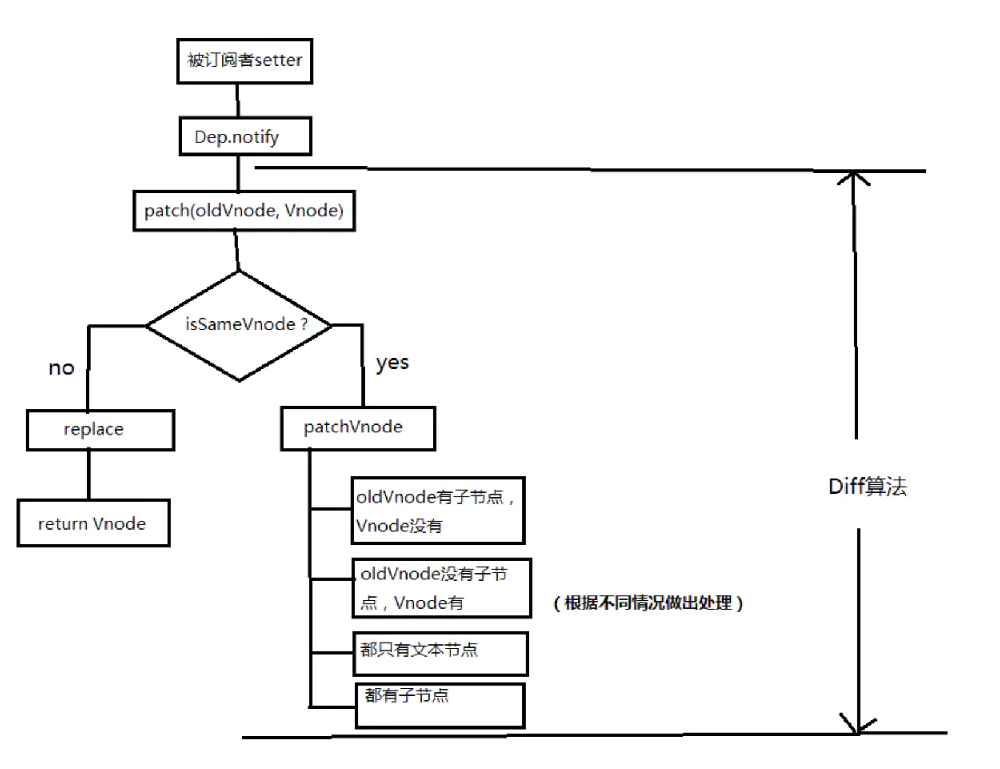

## VUE

### 对 Vue 的理解

- 不完全的MVVM
- 双向数据绑定 Object.defineProperties + 发布订阅模式

- 优点
    - 低耦合
    - 可重用性
    - 可测试

### 什么是 MVVM

    MVVM Model-View-ViewModel 是一种设计思想，可以在Model 中定义数据修改 和 操作的业务逻辑；View 代表 UI组件，他负责将数据模型转化成 UI 展现出来，ViewModel 是一个同步 View 和 Model 的对象。

- 在 MVVM 架构下，View 和 Model 之间并没有直接的联系，而是通过 ViewModel 进行交互，Model 和 ViewModel 之间的交互是双向的，因此 View 数据的变化会同步到 Model 中，而 Model 数据也会立即反应到 View 上。
- ViewModel 通过双向数据绑定把 View 层 和 Model 层链接了起来，而View 和 Model 之间的同步工作完全是自动的，无需人为干涉，因此开发者只需关注业务逻辑，不需要手动操作DOM，不需要关注数据状态的同步问题，负责的数据状态维护完全由 MVVM 来统一管理

### Vue 的优点是什么

- 低耦合
- 可重用性
- 可测试

### Vue 生命周期

- 创建前后：beforeCreate 阶段，vue实例的挂载元素 el 和 数据对象 data 都为 undefined，还未初始化，在 created 阶段，vue实例的数据对象 data 有了，el (DOM节点对象) 还没有
- 载入前后：在 beforeMount 阶段，vue 实例的 $el 和 data 都初始化来，但还是挂载之前为虚拟的dom节点，data.message 还未替换。在 mounted 阶段，vue 实例挂载完成，data.message 成功渲染
- 更新前后
- 销毁前后

- beforeCreate
- created
- beforeMount
- mounted
- beforeUpdate
- updated
- beforeDestroy
- destroy

### Vue3.0 有那些新特性

- vDOM 渲染性能优化
- Tree-shaking 支持
- Composition API
- Fragment、Teleport、Suspense
- 更好的 TS 支持
- 自定义渲染API

- [Vue3.0 性能优化及新特性深度解析](https://juejin.im/post/5ef576605188252e5c575645)

### Vue 2 组件通讯方式

- VUEX
- Event Hub
- $emit / Props
- provide / inject: 父组件中通过provide来提供变量, 然后再子组件中通过inject来注入变量。
- ref
- localStorage / SessionStorage
- $attrs / $listeners

1. 父子组件通信: props; $parent / $children; provide / inject ; ref ;  $attrs / $listeners
2. 兄弟组件通信: eventBus ; 	vuex
3. 跨级通信:  eventBus；Vuex；provide / inject 、$attrs / $listeners

[更多](https://juejin.im/post/5d267dcdf265da1b957081a3#heading-6)

### Vue 双向绑定的实现原理

在 Vue2.0 中通过　`Object.defineProperty` 实现对象的 get 和 set 方法实现数据劫持。结合 `发布 / 订阅者模式` 实现。但是这种实现方式无法完成对数组的监听，Vue2.0中重写了数组的 push pop shift 等方法实现对数组改变的监听。而Vue3中通过使用 ES6 中的 Proxy，实现对所有数据类型数据变化的监听。

```js
var Book = {}
var name = '';
Object.defineProperty(Book, 'name', {
  set: function (value) {
    name = value;
    console.log('你取了一个书名叫做' + value);
  },
  get: function () {
    return '《' + name + '》'
  }
})
 
Book.name = 'vue权威指南';  // 你取了一个书名叫做vue权威指南
console.log(Book.name);  // 《vue权威指南》
```

- 监听器 Observer：劫持并监听所有属性，如果有变动，通知订阅者
- 订阅者 Watcher： 可以收到属性的变化通知，并执行相应的函数，从而更新视图
- 解析器 Compile ：可以扫描和解析每个节点的相关指令，并根据初始化模版数据以及初始化相应的订阅器

##### 实现双向数据绑定

- 在页面元素 `button` 中绑定 `{{count}}`
- 在编译过程是，针对这个 `button` 会产生一个 `Watcher(vm, exp, cb(newValue,oldValue))`，vm 是 `Vue` 对象，`exp` 是数据绑定的数据；cb 的逻辑是用来更新页面
- 实现发布订阅模式，Watcher初始化的时候会将 Dep.target 设置为this，也就是watcher自己，同时会触发 count 的 getter 方法，getter里面会调用 Dep 的 depend 方法，depend 方法会调用 Watcher 的 addDep 方法，addDep 方法就是将 Watcher 自己存放在 Dep 的事件池里面。

### 双向绑定 Proxy 比 definedProperty

##### 实现双向绑定的方法：

- KnockoutJS 观察者模式的双向绑定
- Ember 基于数据模型的双向绑定
- Angular 基于脏检查的双向绑定
- Vue `Object.defineProperties` 和 `Proxy`

##### 数据劫持实现双向数据绑定

```jsx harmony
// 遍历对象,对其属性值进行劫持
Object.keys(data).forEach(function(key) {
  Object.defineProperty(data, key, {
    enumerable: true,
    configurable: true,
    get: function() {
      console.log('get');
    },
    set: function(newVal) {
      // 当属性值发生变化时我们可以进行额外操作
      console.log(`大家好,我系${newVal}`);
      say(newVal);
    },
  });
});
```

优势

1. 无需显示调用
2. 可精确得知变化数据

##### 实现思路

1、 利用 `Proxy` 和 `Object.defineProperty` 生成的 Observer 针对对象/对象属性进行劫持，在属性发生变化后通知订阅者
2、 解析器 `Compile` 解析模版中的 `Directive` 指令，收集指令所依赖的方法和数据，等待数据变化然后进行渲染
3、 `Watcher` 属于 `Observer` 和 `Compile` 的桥梁，他将接收到的 Observer 产生的数据变化，并根据 Compile 提供的指令进行视图渲染，使得数据变化促使视图变化

##### definedProperty 的缺陷

- 无法实现对数组修改的监听，Vue2 重写了 数组的 push、pop、shift、unshift、splice、sort、reverse 方法，但是 `vm.items[index] = newValue` 这种赋值的修改是无法监测的。Proxy 可以
- 只能劫持对象的单个属性，那么我们需要对对象的每个属性进行遍历，如果属性值也是对象则需要深度遍历。

##### Proxy 的 特点

Proxy 在ES6 中被提出，他在目标对象之间架设了一层`拦截`，外界对该对象的访问，都必须先通过这层拦截，因此提供了一种机制，可以对外界的访问进行过滤和改写

- Proxy 可以直接监听对象而非属性

```jsx harmony
const input = document.getElementById('input');
const p = document.getElementById('p');
const obj = {};

const newObj = new Proxy(obj, {
  get: function(target, key, receiver) {
    console.log(`getting ${key}!`);
    return Reflect.get(target, key, receiver);
  },
  set: function(target, key, value, receiver) {
    console.log(target, key, value, receiver);
    if (key === 'text') {
      input.value = value;
      p.innerHTML = value;
    }
    return Reflect.set(target, key, value, receiver);
  },
});

input.addEventListener('keyup', function(e) {
  newObj.text = e.target.value;
});
```

- Proxy 可以直接监听数组的变化

```jsx harmony
let obj = { a: 1, b: 2, c: [1,2,3, {d:1, t:2}] }

let newProxy = new Proxy(obj, { 
  get: (target, key, receiver) => {
    console.log('get'); 
    return Reflect.get(target, key, receiver) 
  }, 
  set: (target, key, value, receiver) => { 
    console.log(target, key, value, receiver); return Reflect.set(target, key, value, receiver); } 
})
```

### computed 和 watch 有什么区别

一个是用于计算一些数据，计算完成后当成一个属性使用，后续其依赖的值改变了之后，才会被修改。而watch则是用于监听数据的改变并做一个任务。

##### computed 

- 计算属性，更多用于计算值的厂家
- 具备缓存性，computed的值是在getter执行后会缓存的，只有它依赖的属性值发生改变后，下次获取computed 的值时才会重新调用对应的getter计算
- 适用于计算比较消耗性能的计算场景

##### watch

- 更多的是观察的作用，类似数据监听毁掉，用于观察 props $emit 或者本组件的值
- 无缓存行，页面重新渲染时也不会执行

### 如何理解VUE的响应式系统

- 任何一个Vue组件都会有一个与之对应的 Watcher 实例
- Vue 的 data 上的 属性会被添加 getter 和 setter
- Vue 组件 render 函数执行时，data 上的属性会被 touch，getter方法会被调用，此时 Vue 会去记录此 Vue component 所依赖的所有的data（这个过程成为依赖收集）。
- data 被改动时，setter 方法会被调用，此时 Vue 会去同志所有依赖于此 data 的组件调用他们的 render 函数进行更新。

### Vue 可以通过数据劫持精准探测数据变化，为什么还需要对 DOM 进行 diff 检测差异

现代前端框架有两种侦测方法：pull 和 push

pull代表为 React。在 React 中常调用 setState API 显示更新。然后 React 会进行一层层的 VDOM Diff 操作找出差异。然后 Patch 到 DOM 上，React 一开始不知道哪里发生变化了，只知道有变化了，然后再比较暴力的 Diff 查找哪里发生变化。

push方式的代表则是 Vue 的响应式系统。当初始化时就会对数据进行依赖收集，一旦数据变化，响应式系统就会立即得知，因此 Vue 是一开始就知道 在哪发生变化的。但是 Vue 绑定一个数据就需要一个 Watcher，一旦我们的绑定颗粒度太高就会产生大量 Watcher，这会带来内存及依赖追踪的开销，而颗粒度过低会无法精准侦测变化，因此 Vue 的设计是选择中等颗粒度的方案。在组件级别进行 push 侦测，然后在组件内部进行 VDOM Diff 获取更加具体的差异。而 VDOM 是 pull 操作，Vue 是 push + pull 结合的方式进行变化侦测的。

### Vue 中的 key 到底有什么用？

key 是vue 中 vnode 标记的唯一 id，通过这个key在 diff 操作的时候可以更准确、快速。

- 准确: 如果不加key,那么vue会选择复用节点(Vue的就地更新策略),导致之前节点的状态被保留下来,会产生一系列的bug.
- 快速: key的唯一性可以被Map数据结构充分利用,相比于遍历查找的时间复杂度O(n),Map的时间复杂度仅仅为O(1).

### Vue diff 算法



- [详解vue的diff算法](https://juejin.im/post/5affd01551882542c83301da)

## VUEX

### Vuex是什么，我们为什么需要vuex

Vuex是 Vue 的状态管理库，类似 React 的 Redux，可以给Vue应用提供一个集中式存储的全局状态。

我们可以简略的看 MVC 和 MVVM 框架，状态在 Model -> Controller -> View -> Model 之间流转。从 Model 到 View 的部分已经被 Vue 之类的框架处理了，我们的状态管理核心要解决的就是从 View 到 Model

Vuex 的优势在于：

- 实现跨组件的通讯
- 清晰的数据流，方便业务理解和错误排查
- 每个实例/组件仍然可以拥有和管理自己的私有状态
- 记录变更 (mutation)、保存状态快照、历史回滚/时光旅行的先进的调试工具

### vuex有哪几种属性？

有五种，分别是 State、 Getter、Mutation 、Action、 Module

- state：存储数据，存储状态；在根实例中注册了store 后，用 this.$store.state 来访问；对应vue里面的data；存放数据方式为响应式，vue组件从store中读取数据，如数据发生变化，组件也会对应的更新。
- getter：可以认为是 store 的计算属性，它的返回值会根据它的依赖被缓存起来，且只有当它的依赖值发生了改变才会被重新计算。
- mutation：更改 Vuex 的 store 中的状态的唯一方法是提交 mutation。
- action：可以包含异步操作，通过提交 mutation 间接更变状态。
- module：将 store 分割成模块，每个模块都具有state、mutation、action、getter、甚至是嵌套子模块。

### Vue.js 中 ajax 请求代码应该写在组件的 methods 中还是 vuex 的 actions 中？

一、如果请求来的数据是不是要被其他组件公用，仅仅在请求的组件内使用，就不需要放入vuex 的state里。

二、如果被其他地方复用，这个很大几率上是需要的，如果需要，请将请求放入action里，方便复用，并包装成promise返回，在调用处用async await处理返回的数据。如果不要复用这个请求，那么直接写在vue文件里很方便。

### 不用 Vuex 会带来什么问题？

一、可维护性会下降，你要想修改数据，你得维护三个地方

二、可读性会下降，因为一个组件里的数据，你根本就看不出来是从哪来的

三、增加耦合，大量的上传派发，会让耦合性大大的增加，本来Vue用Component就是为了减少耦合，现在这么用，和组件化的初衷相背。

### 如何通过访问this.$store.getters.a就能返回对应方法执行后的返回值

```js
Object.defineProperty(store.getters, key, {
  get: function() { return store._vm[key] },
  enumerable: true
})
```

